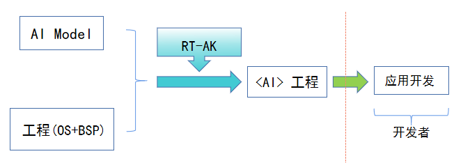
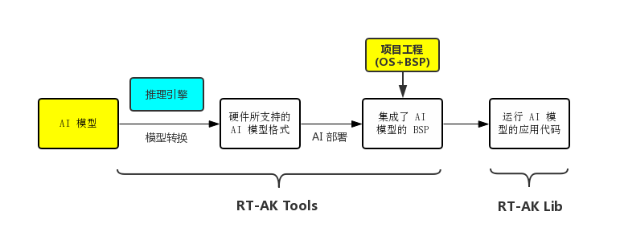
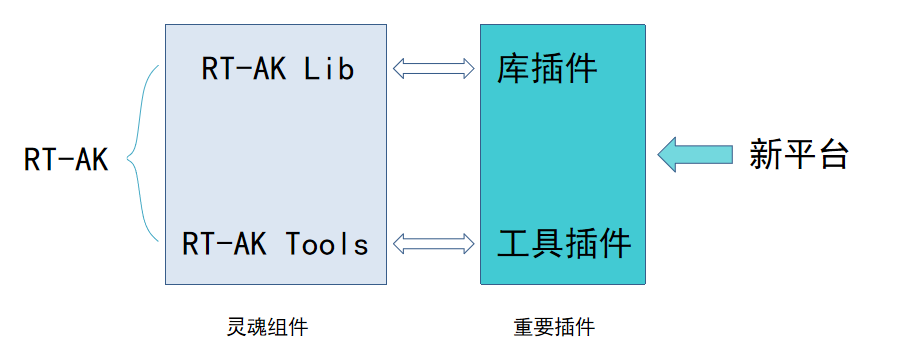
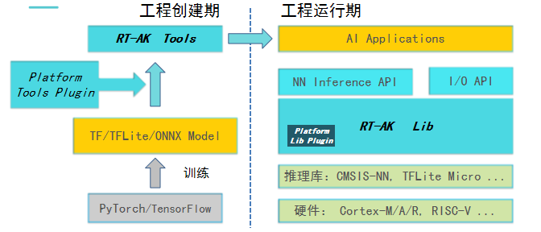
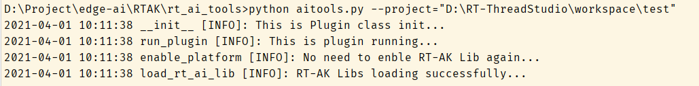
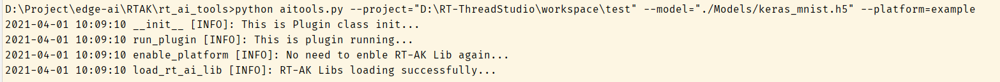
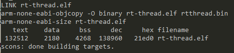

# Table of Contents

- [1. Intro](#1.-intro)
  - [1.1 RT-AK Overview](#1.1-rt-ak-overview)
  - [1.2 RT-AK Components](#1.2-rt-ak-components)
- [2. File Structure](#2.-file-structure)
- [3. Demo](#3.-Demo)
  - [step 1 prepare](#step-1-prepare)
  - [step 2 use RT-AK](#step-2-use-rt-ak)
  - [step 3 build](#step-3-build)
  - [step 4 flashing](#step-4-flashing)
  - [step further](#step-further---use-a-target-platform)
- [4. TODOs](#4.-todos)

**Update 2021/05/26**

- add English  [RT-AK Quick Start](documents/RT-AK%20Quick%20Start.md)

# 1. Intro

`RT-AK` is AI toolkit for RT-Thread RTOS, which makes it possible to just-one-command deploy the AI model into a RT-Thread project.

With `RT-AK`, it requires just one command to integrage an `AI` model into RT-Thread application project.

Let's making it easy to land AI on the edge.  

## 1.1 RT-AK Overview

`RT-AK` needs two inputs to start:

- An application project which contains RT-Thread Kernel and BSP, we will call it BSP project or App project.
- **Neural Network Model** (It is possible to run classic machine learning algorithm on RT-Thread, but RT-AK is focus on DL so far)

Once RT-AK has done its work, the AI model will be integrated into BSP project. Which means BSP project contains all the the code to implement AI model, but without app code (glue code) to trigger the inference. Please refer [RT-AK MNIST 应用参考示例](https://github.com/RT-Thread/RT-AK/blob/main/RT-AK/documents/RT-AK%E5%BF%AB%E9%80%9F%E4%B8%8A%E6%89%8B.md#6-rt-ak-mnist-%E5%BA%94%E7%94%A8%E5%8F%82%E8%80%83%E7%A4%BA%E4%BE%8B) for app code.

App developer may use API of `RT-AK Lib` to make most of the AI parts。 | [API List](./rt_ai_lib/readme.md)



<center><font size=2 color="gray">RT-AK Workflow</font></center>

## 1.2 RT-AK Components

**`RT-AK`  consists tow major components:**

- RT-AK Tools
- RT-AK Lib

|                      | RT-AK Tools                                                  | RT-AK Lib                                                    |
| -------------------- | ------------------------------------------------------------ | ------------------------------------------------------------ |
| function             | Running on PC, converts AI model into codes, put generated contents into BSP project.<br>(Notes: modify the project instead of creating a new one) | Running on target, provides model register, init, run and input/output interface, encapsulate model parsing and loading.<br> |
| path                 | `./rt_ai_tools`                                              | `./rt_ai_lib`                                                |
| description          | [rt_ai_tools/README.md](./rt_ai_tools/README.md)             | [rt_ai_lib/readme.md](./rt_ai_lib/readme.md)                 |
| programming language | `Python`                                                     | `C`                                                          |



<center><font size=2 color="gray">RT-AK Tools and Lib working together</font></center>

> - Date:2021/06/21
>
> - Update:
>
>   RT-AK doesn't provide its own AI tools and inference engine, yet. It relies on those offered by manufacturers to get better performance of the target hardware.
>
>   If you happen using a chip without tools and engine, welcome to PR a new platform plugin or ask for commercial support via business@rt-thread.com .

---

**`RT-AK`  Plugin Structure**



<center><font size=2 color="gray">RT-AK 拓展第三方目标平台</font></center>

`RT-AK` uses plugins to support target platform.

There are two plugins: Lib Plugin and Tool Plugin.

Lib Plugin:

- Bridges the hardware and  `RT-AK Lib` 
- Implements runtime APIs for using AI model on target

Tool Plugin：

- Wrap tools call to convert `AI` model to target format, maybe invovling compression and optimization
- Generate neccessary files and BSP project modifications

Plugin is in `./rt_ai_tools/platforms`, there is a dir named  `plugin_example` which is an example plugin (dummy one).

When adding a new target platform for `RT-AK` , there is no need to modify RT-AK codes, just create these two plugins.

## 1.3 RT-AK Architecture



<center><font size=2 color="gray">RT-AK architecture</font></center>

Left part is architecture of `RT-AK Tools`, right part is architecture of `RT-AK Libs` .

# 2. File Structure

```shell
+---documents
+---examples
+---rt_ai_lib
+---rt_ai_tools
\---test
    +---features
    +---image
    \---step_defs
```

| Folder        | Description                                                  |
| ------------- | ------------------------------------------------------------ |
| `documents`   | `RT-AK` related documents                                    |
| `rt_ai_lib`   | `RT-AK Lib`, runtime framework to bridge target with RT-Thread OS |
| `rt_ai_tools` | `RT-AK Tools`, converting time framework to wrap tool calls  |
| `test`        | `RT-AK` is using `Pytest-bdd` to drive the test              |

# 3. Demo

- [x] **Only Tested on `Windows 10`**
- [x] **Python >= 3.7**
- [x] **This Demo DOSE NOT use any target platform plugin**

## step 1 prepare

| Index |                           Prepare                            |
| :---: | :----------------------------------------------------------: |
|   1   |    Hardware and its BSP project, here we choose `ART-PI`.    |
|   2   | The model,  here we use `./rt_ai_tools/Model/keras_mnist.h5`. |
|   3   |                   Clone the this project.                    |

Firstly, we need an `ART-PI` BSP project, there are two way to create it:

- Use `RT-Thread Studio` to generate one
- Use a pre-created `BSP` 👉 [Download Link](http://117.143.63.254:9012/www/RT-AK/sdk-bsp-artpi.zip)

> - [ ] **TO DO LIST**: This will be replaced by a `QEMU BSP Project to get rid of the hardware dependency.

## step 2 use RT-AK

Onece we done this step, AI is integrated into BSP project, we may enjoy AI app development then.

```shell
$ cd rt_ai_tools

# Use all defaults, target is `./rt_ai_tools/platforms/example`
$ python aitools.py --project=<your_bsp_path>

# To specify path to model and target platform 
$ python aitools.py --project=<your_bsp_path> --model=<model_path> --platform=<platform>
```



<center><font size=2 color="gray">Screenshot for all defaults running</font></center>



<center><font size=2 color="gray">Screenshots for specific model and target</font></center>

## step 3 compile

Just get into the project folder and build.

Here we use  `scons` building system (Let's say you have get  RT-Thread`  [env](https://www.rt-thread.org/document/site/#) ready and know `scons -j 6` to run the build)



<center><font size=2 color="gray">scons build result</font></center>

## step 4 flashing

- Hardware: `ART-PI`
- Flashing Tools:
  - `STM32Programmer`
  - `RT-Thread Studio`
  - `Keil`
  - ...

> TODO: replace it with QEMU target, flashing will be simplified.
>
> If you are not familiar with flashing a board, read step further material following.

## Step further - use a target platform

| config              | description                                                  |
| ------------------- | ------------------------------------------------------------ |
| Target platform     | `STM32`                                                      |
| Project             | `ART-PI BSP`                                                 |
| Model               | `rt_ai_tools/Model/keras_mnist.h5`                           |
| Step by step manual | [RT-AK Quick Start EN.md](documents/RT-AK Quick Start EN.md) |

# 4. TODOs

- [x] Linux Support
- [ ] Windows 7 support
- [ ] Qemu DEMO
- [ ] I/O framework based on rt-device
- [ ] Our own tools and engine
- [ ] Support quantization
- [ ] Classic algorithms
- [ ] Unsupported OP issue
- [ ] Deal with OPS and memory constraints

