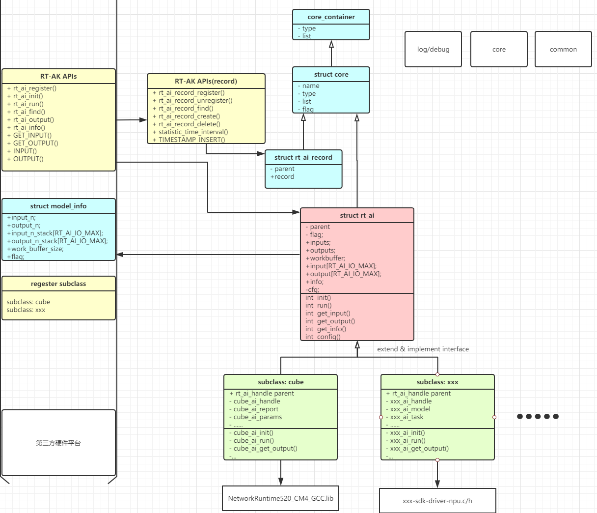

# RT-AK LIB README

[TOC]

# 简介

此工程目录为RT-AK框架运行库，提供相应源码结构以及文档供开发者参考使用。

# RT-AK 运行库结构图

使用面向对象思想, 采用子类继承方式屏蔽不同平台差异.




# 文件以及相关宏定义

## 模型生成文件

其中xxx为模型名

**@file** :rt_ai_xxx_model.c

模型信息(如输入输出, 运行时内存等) 信息声明头文件. 模型的主要信息可查看此头文件.

**@file** :rt_ai_xxx_model.c

模型信息与后端注册源文件

**注:** 根据不同平台差异, 部分平台会存在一个数组文件, 用于**平台特定的序列化模型文件->数组** 转换形式进行加载.

## 运行库源码文件

**@file: rt_ai_def.h**

RT-AK中所使用的类型及通用宏定义

**@file: rt_ai_common.h/c**

RT-AK运行时常用宏及工具定义

**@file: rt_ai_core.c/h**

RT-AK基本结构体, 框架中主要结构体都继承至此结构体, 进行链表集中管理.

**@file: rt_ai_runtime.h/c**

运行时支持库&状态记录链表

**@file: rt_ai_log.h**

log&debug工具

**@file: rt_ai.h/c**

RT-AK主要接口，以及api声明，使用RT-AK开发应用程序时，需包含此头文件

**@file: backend_xxx.h/c**

后端适配层，对于想要适配不同平台的开发者，需要针对不同平台设计并实现此文件

## 模型信息声明

### 宏命名规则:

RT-AK模型信息宏声明使用**RT_AI_name**前缀, 其中**name**为模型名,n为索引数字, platform-name为平台标识名; 

*@file: rt_ai_xxx_model.h*

*参数名仿照CUBE-AI宏命名规则*

**RT_AI\_name_MODEL_NAME** :模型名

**RT_AI\_name_WORK_BUFFER_BYTES** :运行计算时所需内存(平台相关)

**RT_AI\_name_DATA_WEIGHTS_SIZE** :权重字节数(可能平台相关)

**RT_AI\_name_BUFFER_ALIGNMENT** :对齐方式(平台相关)

**RT_AI\_name_IN/OUT_NUM** : 模型输入/输出数量

**RT_AI\_name_IN/OUT_n_SIZE** : 第n个输入/输出尺寸

**RT_AI\_name_IN/OUT_n_SIZE_BYTES** : 第n个输入/输出所占字节

**RT_AI\_name_IN/OUT_SIZE_BYTES** : 每个输入/输出占用字节数声明

**RT_AI\_name_IN/OUT_TOTAL_SIZE_BYTES** :输入占用总字节

**RT_AI\_name_TOTAL_BUFFER_SIZE** :模型运行总字节数

**更新:**

**RT_AI_name_IN/OUT_n_FMT_DTYPE:** 数据类型,可取 RT_AI_FMT_INT8, RT_AI_FMT_FLOAT32

**RT_AI_name_IN/OUT_n_FMT_CHANNEL:** 可取: RT_AI_FMT_CHANNEL_LAST, RT_AI_FMT_CHANNEL_FIRST, RT_AI_FMT_HWC, RT_AI_FMT_CHW, RT_AI_FMT_WHC

*@file: rt_ai_xxx_model.c*

**RT_AI\_name_INFO** :模型信息初始化声明

**RT_AI\_name_HANDLE** : RT-AK句柄初始化声明

**RT_AI\_platform_name** :平台相关结构体初始化声明(预计将在下个迭代更名为RT_AI\_platform\_name)

**ALLOC_WORK_BUFFER_FLAG** :分配运行时内存
**ALLOC_INPUT_BUFFER_FLAG** :分配模型输入数据内存
**ALLOC_OUTPUT_BUFFER_FLAG** :分配模型输出结果内存

#### 平台差异性说明

* 根据平台差异, 部分平台未使用**AI\_ name_WORK_BUFFER_BYTES**信息
* **RT_AI\_name_DATA_WEIGHTS_SIZE** :权重字节数(可能平台相关)
* **RT_AI\_name_BUFFER_ALIGNMENT** :对齐方式(平台相关)

#### STM32-CUBE

使用`rt_ai_init()`初始化时, 传入运行时内存大小应为**AI_name_WORK_BUFFER_BYTES**+**RT_AI\_name_IN/OUT_TOTAL_SIZE_BYTES** , 即计算内存与输入输出内存总和;

### 后端结构体

#### CUBE-AI

`struct cube_ai`

#### 其他平台

## 模型&平台注册例程:

```cpp
/* based on cube */
#define RT_AI_MNIST_INFO    {       \
    RT_AI_MNIST_IN_NUM,             \
    RT_AI_MNIST_OUT_NUM,            \
    RT_AI_MNIST_IN_SIZE_BYTES,      \
    RT_AI_MNIST_OUT_SIZE_BYTES,     \
    RT_AI_MNIST_WORK_BUFFER_BYTES,  \
    ALLOC_WORK_BUFFER_FLAG | ALLOC_INPUT_BUFFER_FLAG | ALLOC_OUTPUT_BUFFER_FLAG \
}

#define RT_AI_MNIST_HANDLE  {         \
    .info   =     RT_AI_MNIST_INFO    \
}

#define CUBE_AI_MNIST_PARAMS     {      \
    .params        = AI_MNIST_DATA_WEIGHTS(NULL),   \
    .activations   = AI_MNIST_DATA_ACTIVATIONS(NULL), \
}

#define RT_CUBE_AI_MNIST {      \
    .parent         = RT_AI_MNIST_HANDLE,          \
    .handle         = AI_HANDLE_NULL,     \
    .params         = CUBE_AI_MNIST_PARAMS,         \
    .get_info       = ai_mnist_get_info,  \
    .get_error      = ai_mnist_get_error, \
    .create         = ai_mnist_create,    \
    .destroy        = ai_mnist_destroy,   \
    .init           = ai_mnist_init,      \
    .run            = ai_mnist_run,       \
    .forward        = ai_mnist_forward,   \
    .weights_get    = ai_mnist_data_weights_get, \
}

static struct cube_ai rt_cube_ai_mnist_model = RT_CUBE_AI_MNIST;

static int rt_ai_mnist_model_init(){
    rt_ai_register(RT_AI_T(&rt_cube_ai_mnist_model),RT_AI_MNIST_MODEL_NAME,0,backend_cubeai,&rt_cube_ai_mnist_model);
    return 0;
}
INIT_APP_EXPORT(rt_ai_mnist_model_init);
```

# RT-AK 组件&API:

`rt_err_t rt_ai_register(rt_ai_t ai, const char *name, rt_uint16_t flags,int (*call)(void *arg), void *arg);`


| **Paramaters** | **Description** |
| - | - |
| ai | 模型句柄 |
| name | 模型名 |
| flags | 标志(**暂未使用**) |
| call | 后端&模型注册 |
| arg | 后端句柄 |
| **Return** | -- |
| rt_ai_t | 已注册模型句柄 |
| NULL | 未发现模型 |

**描述** :后端模型进行注册.

`rt_ai_t  rt_ai_find(const char *name);`


| **Paramaters** | **Description** |
| - | - |
| name | 注册的模型名 |
| **Return** | -- |
| rt_ai_t | 已注册模型句柄 |
| NULL | 未发现模型 |

**描述** :查找已注册模型

`rt_err_t rt_ai_init(rt_ai_t ai, rt_aibuffer_t* work_buf);`


| **Paramaters** | **Description** |
| - | - |
| ai | rt_ai_t 句柄 |
| work_buf | 运行时计算所用内存 |
|   |   |
| **Return** | -- |
| 0 | 初始化成功 |
| 非0 | 初始化失败 |

**描述** :初始化模型句柄, 挂载模型信息, 准备运行环境.

`rt_err_t rt_ai_run(rt_ai_t ai, void (*callback)(void * arg), void *arg);`


| **Paramaters** | **Description** |
| - | - |
| ai | rt_ai_t 模型句柄 |
| callback | 运行完成回调函数 |
| arg | 运行完成回调函数参数 |
| **Return** | -- |
| 0 | 成功 |
| 非0 | 失败 |

**描述** :模型推理计算

`rt_aibuffer_t rt_ai_output(rt_ai_t aihandle,rt_uint32_t index);`


| **Paramaters** | **Description** |
| - | - |
| ai | rt_ai_t 模型句柄 |
| index | 结果索引 |
| **Return** | -- |
| NOT NULL | 结果存放地址 |
| NULL | 获取结果失败 |

**描述** :获取模型运行的结果, 结果获取后.

`rt_aibuffer_t rt_ai_input(rt_ai_t ai, rt_uint32_t index);`


| **Paramaters** | **Description** |
| - | - |
| ai | rt_ai_t 句柄 |
| index | 输入索引 |
| **Return** | -- |
| NOT NULL | 加载成功 |
| NULL | 获取失败 |

**描述** : 获取输入地址

rt_err_t  rt_ai_config(rt_ai_t ai, rt_uint32_t cmd, void *args);`


| **Paramaters** | **Description** |
| - | - |
| ai | rt_ai_t 句柄 |
| cmd | 命令 |
| args | 参数 |
| **Return** | -- |
| 0 | 成功 |
| 非0 | 失败 |

**描述** : 运行参数相关配置, 具有平台相关性. 相关命令定义在backend_xxx.h

## RT-AK 组件

框架使用面向对象思想进行设计，框架中大多数结构体都集成自基础对象，并由框架核心部分进行链表方式管理。

### 基本结构体:struct rt_ai_core

```
struct rt_ai_core
{
    char name[RT_AI_NAME_MAX]; /**对象名 */
    rt_uint8_t type;           /**< 对象类型 */
    rt_uint8_t flag;           /**< 标志位，暂未使用 */
    rt_list_t  list;            /**< 链表 */
};
typedef struct rt_ai_core *rt_ai_core_t; /**< Type for kernel objects. */
```

基本结构体, `struct rt_ai`与`rt_ai_record`等框架相关结构体都继承至此结构体, 挂载容器链表中进行统一管理.其中对象类型可取如下枚举类型定义：

```
/*
 * define object type info for the number of rt_ai_core_container items.
 */
enum rt_ai_obj_type
{
    RT_AI_CLASS_HANDLE = 0, /**< The type is a rt_ai. */
#ifdef RT_AI_USE_RECORD
    RT_AI_CLASS_RECORD, /**< The object is a record. */
#endif
    RT_AI_CLASS_UNKNOWN, /**< The object is unknown. */

    RT_AI_CLASS_STATIC = 0X80, /** RT_AI STATICAL TYPE */
    RT_AI_CLASS_STATIC_HANDLE   = RT_AI_STATICIAL_TYPE(RT_AI_CLASS_HANDLE),
#ifdef RT_AI_USE_RECORD /**< The type is a statical rt_ai. */
    RT_AI_CLASS_STATIC_RECORD   = RT_AI_STATICIAL_TYPE(RT_AI_CLASS_RECORD),
#endif /**< The type is a statical record. */
    RT_AI_CLASS_STATIC_UNKNOWN  = RT_AI_STATICIAL_TYPE(RT_AI_CLASS_UNKNOWN), /**< The type is a statical unknow. */
};
```


### 模型信息: struct rt_ai_info

```
typedef struct rt_ai_info *rt_ai_info_t;
struct rt_ai_info
{
    rt_uint32_t input_n;	/** 模型输入数 */
    rt_uint32_t output_n;	/** 模型输出数 */
    rt_uint32_t input_n_stack[RT_AI_IO_MAX];	/** 输入字节数 */
    rt_uint32_t output_n_stack[RT_AI_IO_MAX];	/** 输出字节数 */
    rt_uint32_t work_buffer_size; 				/** 运行时内存 */
};
```

保存着神经网络模型相的关信息

### 运行句柄: struct rt_ai

```
typedef struct rt_ai *rt_ai_t;

/**
 * ai handle structure
 */
struct rt_ai
{
    struct rt_ai_core   parent;		/** 父对象 */
    rt_ai_uint16_t      flag; /**< ai flag */
    rt_ai_uint16_t      mem_flag;	/** 内存相关标志 */
    rt_ai_buffer_t      *workbuffer;           /** 运行时内存 */
    rt_ai_buffer_t      *input[RT_AI_IO_MAX];  /* 输入地址索引 */
    rt_ai_buffer_t      *output[RT_AI_IO_MAX]; /* 输出地址索引 */
    struct rt_ai_info   info;					/** 模型信息 */
    void                *cfg; /** 平台相关配置 */

#ifdef RT_USING_AI_OPS
    const struct rt_ai_ops *ops;
#else
    /* common ai interface 
     *@return 0:OK; other:fail
    */
    /* 后端初始化，应在此阶段完成模型运行准备工作 */
    int (*init)         (rt_ai_t ai, rt_ai_buffer_t *buf);
    /* 获取模型运行的输入地址 */
    int (*get_input)    (rt_ai_t ai, rt_ai_uint32_t index);
    /* 启动推理, 后端推理完成时调用callback函数通知计算完成 */
    int (*run)          (rt_ai_t ai, void (*callback)(void *arg), void *arg);
    /* 获取模型计算输出结果存放地址 */
    int (*get_output)   (rt_ai_t ai, rt_ai_uint32_t index);
    /* 获取模型及后端相应信息,暂未使用 */
    int (*get_info)     (rt_ai_t ai, rt_ai_buffer_t *buf);
    /* 进行后端相关配置 */
    int (*config)       (rt_ai_t ai, int cmd, rt_ai_buffer_t *args);

#endif
    /* callback when run done */
    void (*done_callback_user)(void *arg);
    void *arg;
};
```

RT-AK主要句柄, 保存着模型信息, 运行接口等所有运行时信息与环境. 使用`rt_ai_register()`将模型句柄注册到模型链表中, 使用`rt_ai_find()`查询句柄链表, 并返回句柄的地址. 对于不同平台进行适配时, 应设计子类继承自此结构体.

### 记录: rt_ai_record

```
typedef struct rt_ai_record *rt_ai_record_t;
struct rt_ai_record
{
    struct rt_ai_core   parent;	/** 父类对象 */
    rt_ai_uint32_t      record;	/** 通用记录 */
};
```

成员record为记录变量, 用于保存需要保存的状态信息, 如时间, 当前当前运行的句柄等. 使用`rt_ai_record_create()`可以创建一个rt_ai_record变量, 并自动挂载到record链表中进行管理. `rt_ai_record_find()`用于查找一个已经挂载到链表中的rt_ai_record变量,


