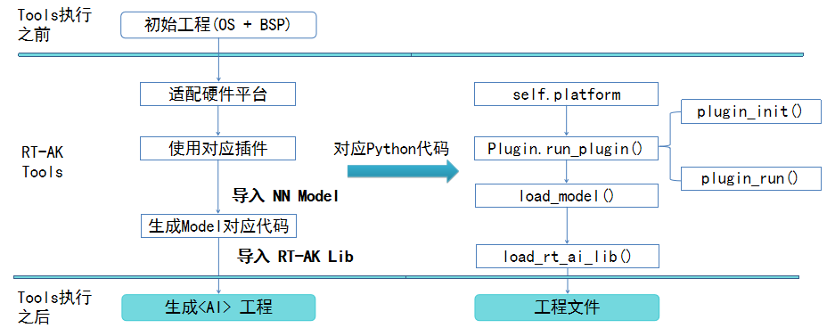

- [1. 目录结构](#1.-目录结构)
- [2. RT-AK Tools 使用说明](#2.-RT-AK-Tools-使用说明)
- [3. RT-AK Tools 参数](#3.-RT-AK-Tools-参数)
- [4. RT-AK Tools 内部代码逻辑](#4.-RT-AK-Tools-内部代码逻辑)

# RT-AK Tools

> Update: 
>
> 新增查看模型信息模块，目前仅支持 `keras`，需要 `tensorflow>=2.2`，
>
> 运行结束之后将会在该目录下生成一个 `<model_name>_info.txt` 文件，示例：[keras_mnist_info.txt](./utils/keras_mnist_info.txt)
>
> ```shell
> $ cd utils
> 
> # 默认是 rt_ai_tools/Model/keras_mnist.h5
> $ python model_info.py --model=<your_model_path>
> ```

`RT-AK Tools` 是 `RT-AK` 在上位机上的主要运行代码，用一行命令实现 `AI` 模型部署到嵌入式设备中，

请注意，此时不包含在嵌入式设备端实际调用 AI 模型进行推理的应用代码，该部分代码需要用户自行编写，或者参考我们的案例代码




<center><font size=2 color="gray">RT-AK Tools 的工作流程</font></center>

## 1. 目录结构

```bash
D:\Project\edge-ai\RT-AK\rt_ai_tools>tree /a
卷 软件 的文件夹 PATH 列表
卷序列号为 E67E-D1CA
D:.
+---Documents
+---Model
+---platforms
|   +---example
|   +---k210  # 模型支持: TFLite | Caffe | ONNX
|   \---stm32  # 模型支持: Keras | TFLite | Caffe | ONNX
+---test
|   +---data
|   +---features
|   \---step_defs
\---utils
```

| Dir         | Description                                            |
| ----------- | ------------------------------------------------------ |
| `Documents` | `RT-AK Tools` 相关文档                                 |
| `Model`     | 神经网络模型库                                         |
| `platforms` | 第三方目标平台插件，比如：`STM32`， `K210`             |
| `test`      | `RT-AK Tools` 测试用例，使用的是 `Pytest-bdd` 测试框架 |

## 2. RT-AK Tools 使用说明

- 与目标平台无关

  演示示例，请查阅：[演示示例](https://github.com/RT-Thread/RT-AK/tree/main/RT-AK#3-%E6%BC%94%E7%A4%BA%E7%A4%BA%E4%BE%8B)

- 与目标平台相关

  请查阅对应的目标平台插件仓库的 readme 文档，里面有详细说明。

  比如：[RT-AK-plugin-stm32](https://github.com/RT-Thread/RT-AK-plugin-stm32)

## 3. RT-AK Tools 参数

`RT-AK Tools` 参数部分主要有两部分组成：

- 基础参数（就是下面这个参数部分）
- 插件参数（在各个插件的仓库里可见，此处不可见）

| Parameter             | Description                                                  |
| --------------------- | ------------------------------------------------------------ |
| `--log`               | `log` 日志存放路径，默认是空，如果有，则将保存log日志文件，例如：`./log.log` |
| `--project`           | `OS+BSP` 项目工程文件夹，默认为空，**需要用户指定**          |
| `--model`             | 神经网络模型文件路径，默认为 `./Models/keras_mnist.h5`       |
| `--model_name`        | 神经网络模型转换后新的模型名，默认是 `network`               |
| `--rt_ai_lib`         | `RT-Thread` 官方提供的 `RT-AK Lib` ，默认是 `../rt_ai_lib`   |
| `--pull_repo_only`    | 判断是否仅拉取 `RT-AK` 所支持的插件仓库，默认是 `Flase`      |
| `--support_platforms` | 存放 `RT-AK` 支持的第三方目标平台插件，`platform: platform_git_url` 格式，默认是`platforms/support_platforms.json` |
| `--platform`          | 指定目标平台信息，目前支持：`stm32`、`k210`，默认是 `example`，具体体可用的目标平台由 `platforms/xxx.json` 注册 |

```shell
# 查看 ai_tools 的所有参数信息
$ python aitools.py --help
```

> update: 2021/08/02
>
> author: lebhoryi@gmail.com

新增单独拉取插件仓库的功能：

```shell
$ python aitools.py --pull_plugin_repo=True --platform=<support_platform>
```

## 4. RT-AK Tools 内部代码逻辑

- 加载基础参数
- 设置 `logging` 等级
- 克隆/拉取最新第三方目标平台插件代码
- 加载插件参数
- 执行插件相关工作
- 打开 `RT-AK Lib` 中插件的的适配层
- 复制 `RT-AK Lib` 到项目工程中

| Index | Function                    | Description                                                  |
| :---: | --------------------------- | ------------------------------------------------------------ |
|   1   | install_plugin.git_plugin() | 克隆插件仓库，若存在，则拉取最新的仓库代码                   |
|   2   | load_sub_parsers()          | 解析指定目标平台插件参数                                     |
|   3   | Plugin.run_plugin()         | 运行指定目标平台插件，比如模型转换。如果有相关库依赖，将相关库复制到 `project` 路径下 |
|   4   | enable_platform()           | 开启 `RT-AK Lib` 中目标平台相关库支持，如果已经开启过某个平台，先关闭后打开新的目标平台插件相关库 |
|   5   | load_rt_ai_lib()            | 复制 `RT-AK Lib` 到项目工程中，如果已经存在，则先删除后复制  |

