# 基于Zynq UltraScale+ MPSoC的DPU在RT-Thread Smart下的移植

## 项目介绍

Vitis AI开发环境可在赛灵思硬件平台上加速AI推理，该开发环境已将底层可编程逻辑的复杂细节抽象化，从而帮助不具备FPGA硬件专业知识的软件开发者开发AI应用。我们以Xilinx Vitis AI v1.2版本为基础，结合Xilinx官方文档等资料，首先收集并梳理Vitis AI开发流程与软件的内部运行机制：

1. 硬件平台基于黑金AXU2CGB，其芯片类型为Zynq UltraScale+ MPSoC，可利用PS端ARM核与PL端可编程逻辑实现Vitis AI的深度学习处理器（DPU）的部署，与AI应用的加速推理；
2. 梳理基于Vitis AI的DPU硬件加速平台的基本概念，了解PL端DPU硬件与PS端如何通信与控制；梳理网络模型的量化、编译等处理是如何进行的，梳理经处理的网络模型以何种方式被DPU硬件所加速的；
3. 实现Vitis AI应用在开发板的全流程部署，并总结了文字资料，包括：
   1. CNN网络模型的量化、编译；
   2. 基于Zynq UltraScale+ MPSoC的DPU硬件（DPUCZDX8G）的开发流程与集成至定制开发板；
   3. 借助交叉编译工具链，完成边缘端应用程序的编写与编译；
   4. 部署并运行模型，借助DPU硬件，实现AI应用的加速推理；
4. 基于Vitis AI v3.0及配套软件，梳理通过Vivado工作流与Petalinux，将DPU硬件集成到定制开发板上，并构建Linux系统映像的开发流程；
5. 分析Vitis AI v1.2与v3.0软件平台的架构，梳理Vitis AI Library、VART运行时的运行机制。分析移植工作的软件层面为了实现控制DPU的所需的部件，从而裁剪出移植至RT Smart上所需的最少组件；

在此之后，我们总结移植到RT Smart系统上所必需开展的工作，并尝试：

1. 整合开发板启动时所需的相关文件，包含启动文件及必要的BSP、外设驱动；
2. 整合RT Smart的源码，与驱动DPU的最小组件源代码；
3. 使用特定的交叉编译工具链，编译源码至aarch64平台上；
4. 上板测试，验证能否通过软件控制DPU硬件，从而验证DPU移植是否成功；

以下将分为几个部分：

1. [基于Vivado 2022.2工作流集成适用于ZynqMP的DPU IP](#基于vivado-20222工作流集成适用于zynqmp的dpu-ip)
2. [基于Petalinux 2022.2创建并配置系统映像](#基于petalinux-20222创建并配置系统映像)
3. [基于黑金提供的示例的流程梳理](#基于黑金提供的示例的流程梳理)
4. [项目遇到的问题](#项目遇到的问题)

## 基于Vivado 2022.2工作流集成适用于ZynqMP的DPU IP

### 环境及软件

Linux/Windows均可。Vivado 2022.2，DPUCZDX8G V4.1，DPU IP及软件版本兼容性如[IP and Tool Version Compatibility](https://xilinx.github.io/Vitis-AI/3.0/html/docs/reference/version_compatibility.html#version-compatibility)所示：

<div align=center>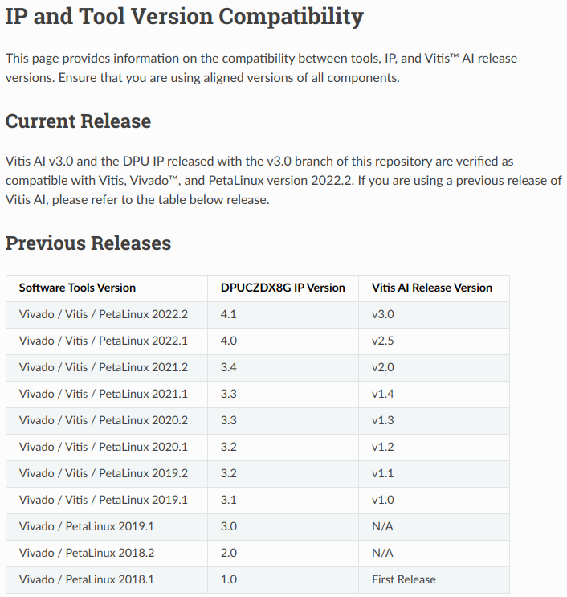</div>

DPU V4.1参考设计及IP下载：[Vitis™ AI DPU IP and Reference Designs](https://github.com/Xilinx/Vitis-AI/blob/3.0/dpu/README.md)

### 创建工程及添加Zynq IP核

1. 打开Vivado 2022.2，创建新工程，设置工程名、工程目录。如下图所示，工程将建立在 `~/WORK/ospp/workspace/axu2cgb_hw_dpu` 目录下，同时生成 `axu2cgb_hw_dpu.xpr` 工程文件。

<div align=center>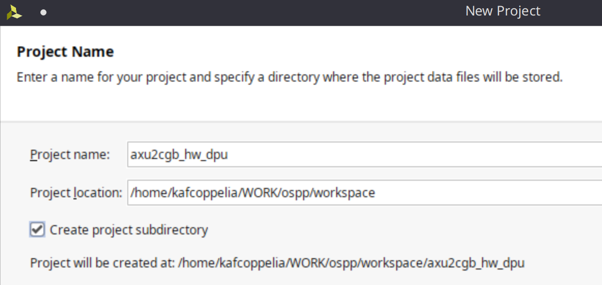</div>

2. “Project Type“选择RTL Project，“Add Sources“、“Add Constraints“跳过，“Default Part“下，搜索FPGA型号xczu2cg-sfvc784-1-e，选中，最后完成工程的创建。

<div align=center>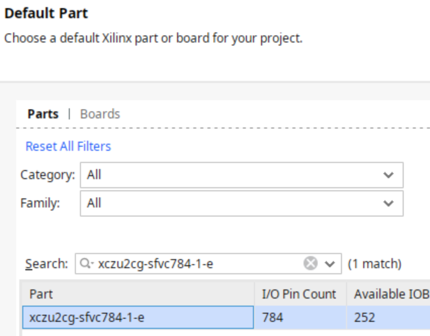</div>

3. 点击左侧“Flow Navigator“栏目下“IP INTEGRATOR“内“Create Block Design”，创建一个图形化框图设计，“Design name”可修改，其余默认即可。

<div align=center>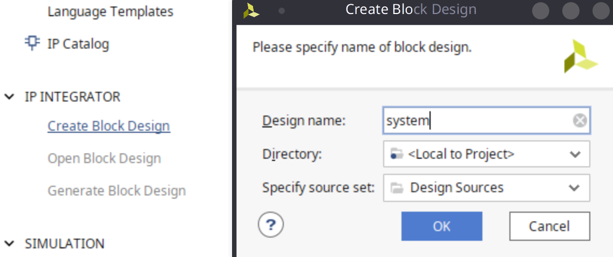</div>

4. 点击加号，添加Zynq UltraScale+ MPSoC IP，添加到Diagram后，双击该IP核，进行参数配置。

<div align=center>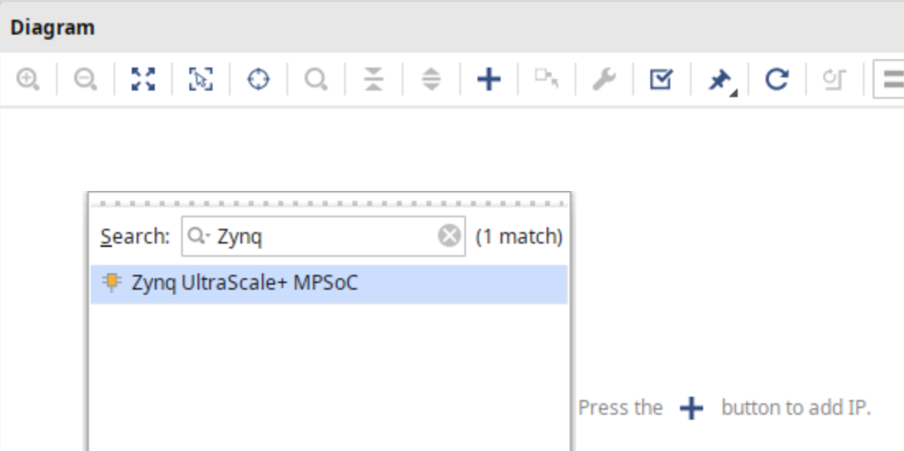</div>

### 配置Zynq IP核

#### I/O Configuration

1. 上方“MIO Voltage Standard”内，BANK0~2均设置为LVCMOS18、BANK3设置为LVCMOS33。“Low Speed”下勾选QSPI，设置Single、x4、勾选Feedback Clk。

<div align=center>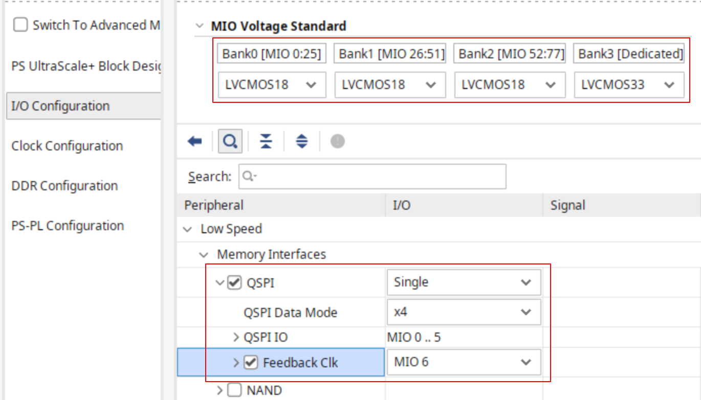</div>

1. 下方，勾选SD0，配置eMMC，选择MIO13..22、“Slot Type”选择eMMC、8bit，勾选Reset。

<div align=center>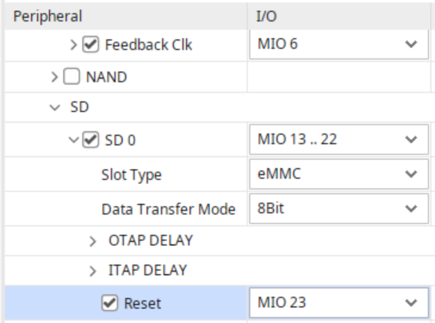</div>

3. 勾选SD1，配置SD卡。**先将**Slot Type选择为SD2.0，**再选择**MIO46..51，4bit，勾选CD。

<div align=center>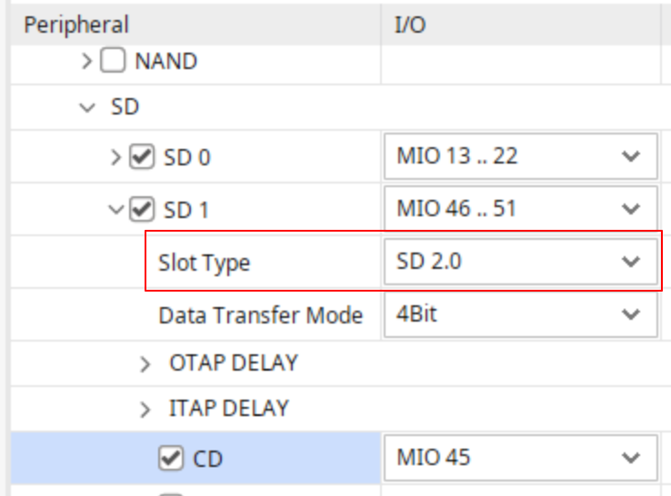</div>

4. I/O Peripherals下，I2C勾选I2C1，选择MIO32..33；UART勾选UART1，选择MIO24..25；

<div align=center>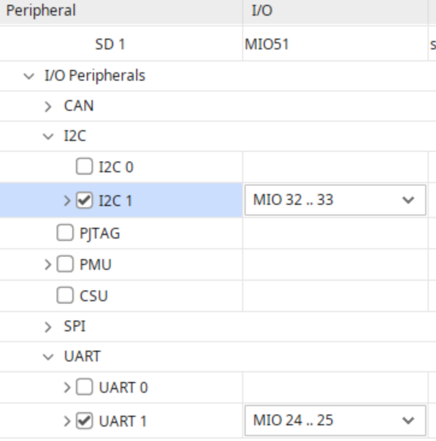</div>

5. Processing Unit下，TTC勾选TTC0~3。

<div align=center>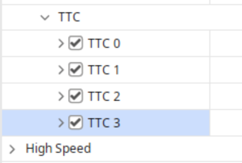</div>

6. 继续在“High Speed”下，勾选GEM3，配置以太网，勾选MDIO3。

<div align=center>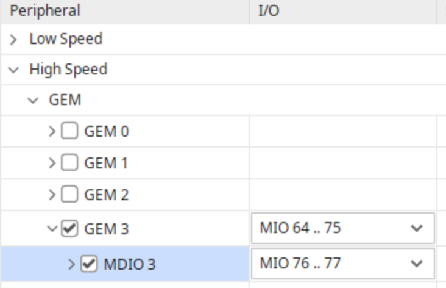</div>

7. USB下，勾选USB0，勾选USB3.0，选择 GT Lane1。“USB Reset”下，改成Shared MIO Pin，勾选USB0，选择MIO 44。

<div align=center>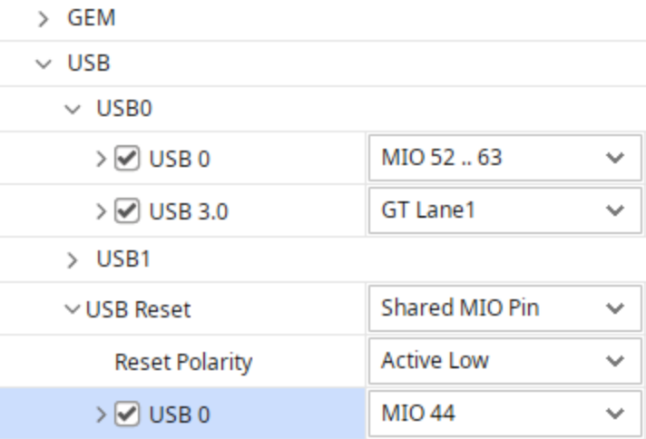</div>

8. 勾选PCIe，之后勾选左上角“Switch To Advanced Mode”，进入“PCIe Configuration”。

#### PCIe Configuration

1. 修改如图所示的几个参数。

<div align=center>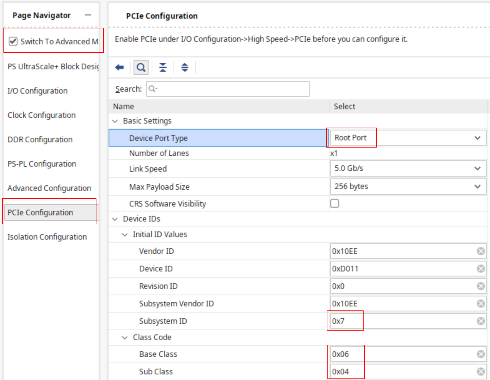</div>

2. 回到“I/O Configuration”，PCIe下“Rootport Mode Reset”选择MIO 37。勾选Display Port，“DPAUX”选择MIO27..30。

<div align=center>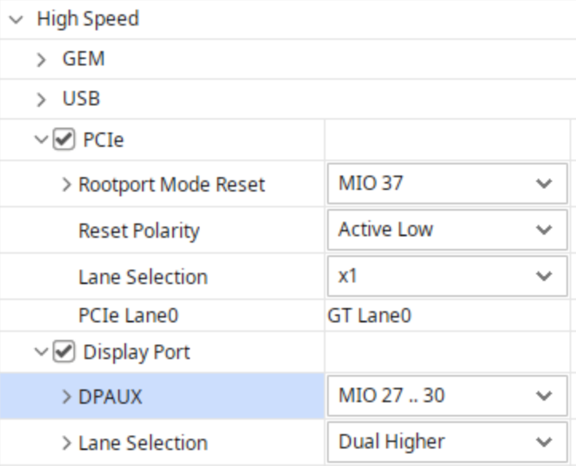</div>

#### Clock Configuration

1. “Input Clocks”栏目下，PSS_REF_CLK默认33.333MHz，PCIe选择Ref Clk0，Display Port选择Ref Clk2，USB0选择Ref Clk1。

<div align=center>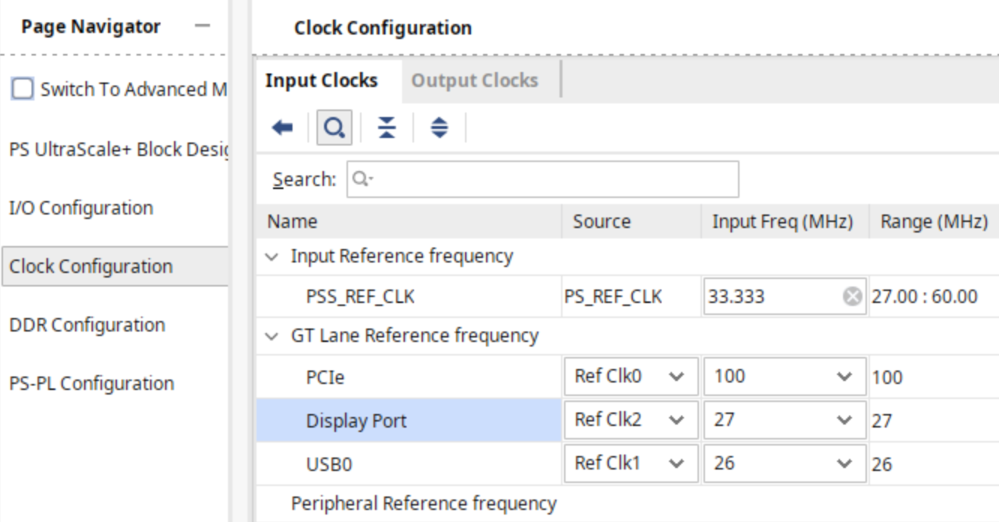</div>

2. “Output Clocks”栏目下，“Low Power Domain CLocks“的前两项内，从CPU_R5开始到GEM_TSU的时钟均改为IOPLL。

<div align=center>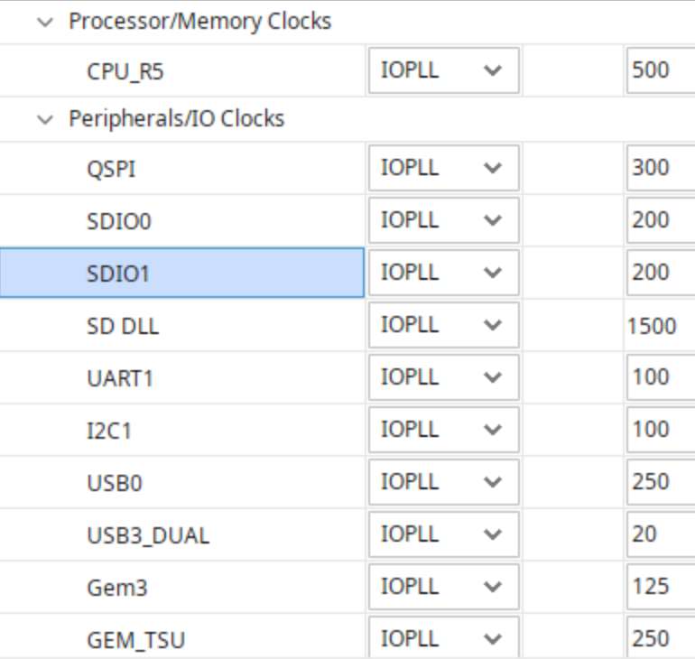</div>

3. 继续，“Full Power Domain Clocks”下，修改DP与最下方Interconnect相关的几个时钟\*。

<div align=center>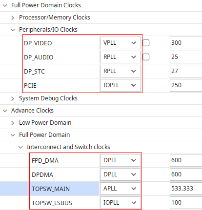</div>

#### DDR Configuration

1. Load DDR Presets”选择DDR4_MICRON_MT40A256M16GE_083E。

<div align=center>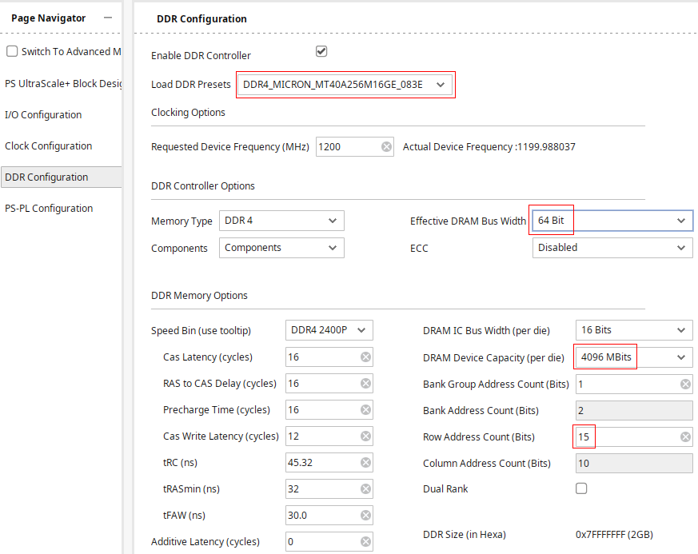</div>

#### DPU IP

##### 配置DPU

1. 添加DPU IP至IP Catalog。点击左侧“Project Manager“下”IP Catalog“，如下图所示。右键单击并选中Add Repository，然后选择 DPUCZDX8G IP的位置。例如，下载的DPU IP的文件为“DPUCZDX8G_VAI_v3.0”

<div align=center>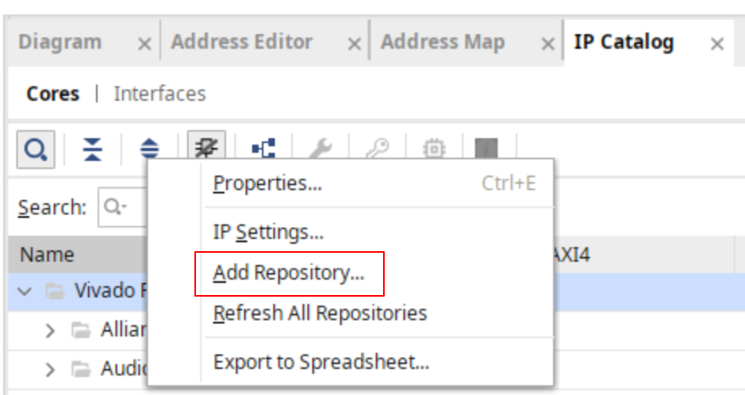</div>

<div align=center>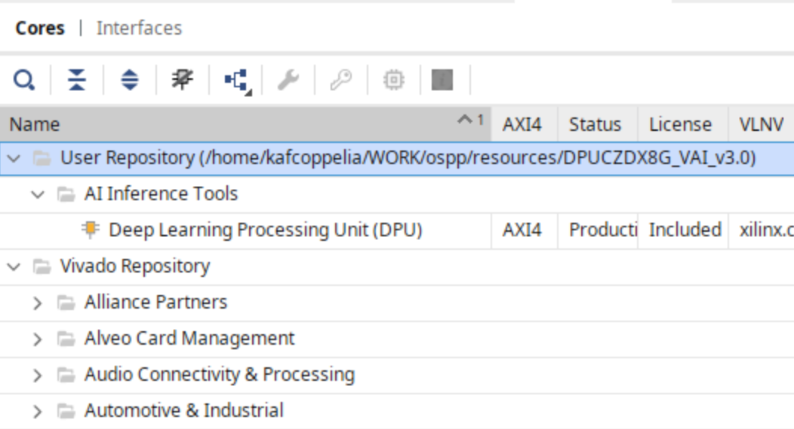</div>

2. 在Diagram内，将DPUCZDX8G IP添加到设计中。配置DPU IP，如下图所示。

<div align=center>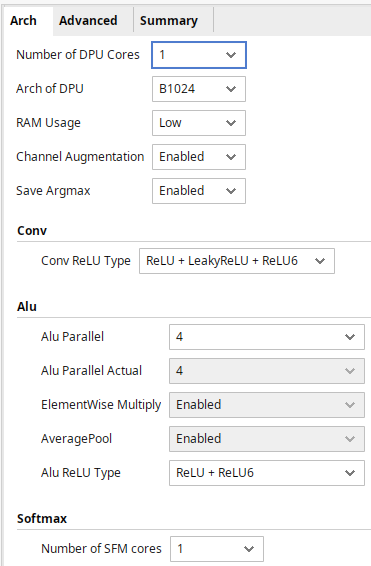</div>

<div align=center>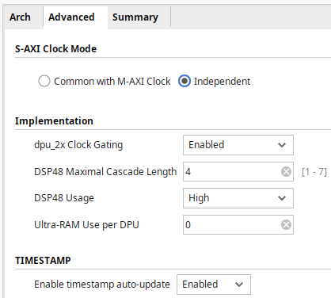</div>

  此时，DPU IP的端口如下图所示。

<div align=center>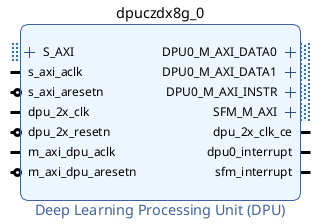</div>

##### Zynq设置中断及AXI

1. 配置Zynq IP核的中断、AXI总线。每个DPUCZDX8G都有3个主接口，1个用于指令提取，其余2个用于数据访问。配置Zynq IP，在”PS-PL Configuration”下，打开PL-PS的IRQ0中断。

<div align=center>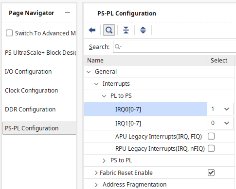</div>

2. 开启Zynq的AXI。在“PS-PL Interfaces”下Master端，开启AXI HPM0 LPD，位宽32，将DPU的从端口连接至此。Slave端，开启AXI HP0/1/2 FPD，位宽128，，用于与DPU的数据传输，开启AXI LPD，位宽32，用于指令提取。

<div align=center>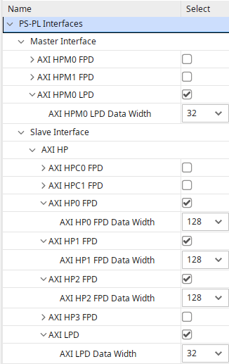</div>

   此时，Zynq IP如图所示。

<div align=center>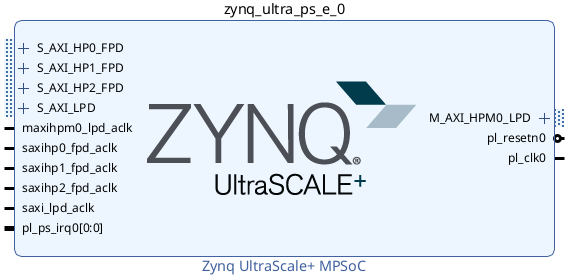</div>

3. 添加时钟。点击Diagram上方加号，或者右键“Add IP”，添加Clock Wizard IP，并配置如下：“Clock Options”下，勾选Auto、Frequency Synthesis；

<div align=center>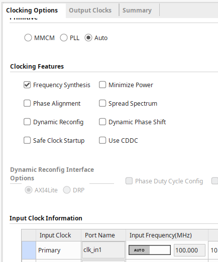</div>

   “Output Clocks”下，勾选clk_out1与clk_out2，分别命名clk_dsp、clk_dpu，频率分别为650、325MHz，拉到右侧，将clk_dsp的“Drives”修改为Buffer with CE；两个时钟均勾选“Matched Routing“。下方，勾选reset、locked、Active Low与LATENCY。

<div align=center>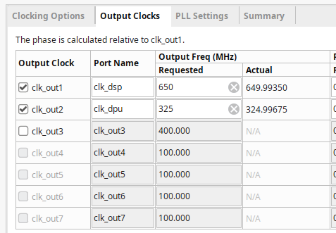</div>

<div align=center>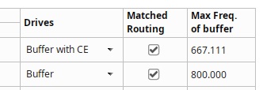</div>

<div align=center>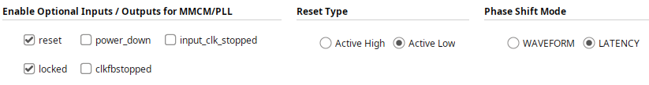</div>

4. 为整个系统添加三个复位IP，添加Processor System Reset IP，分别命名rst_gen_clk、rst_gen_reg、rst_gen_clk_dsp。

5. 添加一个Concat IP，“Number of Ports”设置为2，In0与In1的宽度均为1。

6. 此时：

<div align=center>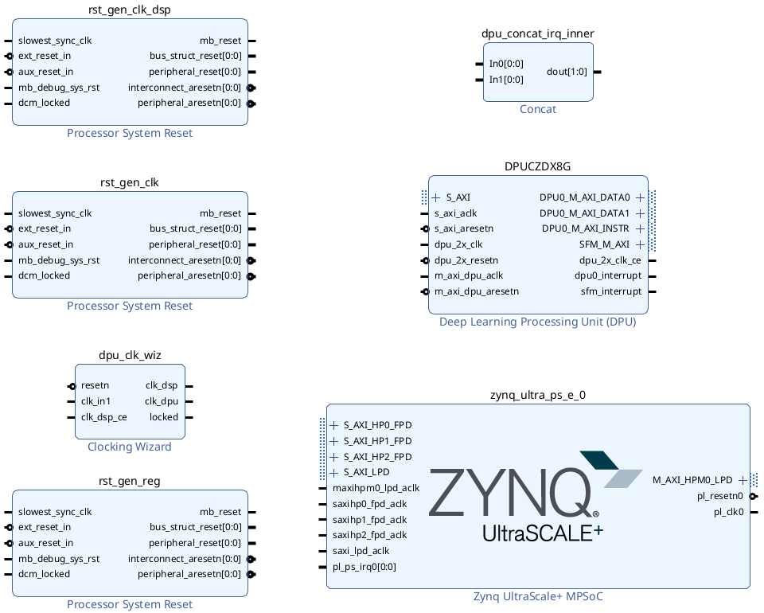</div>

#### 系统连线

<div align=center>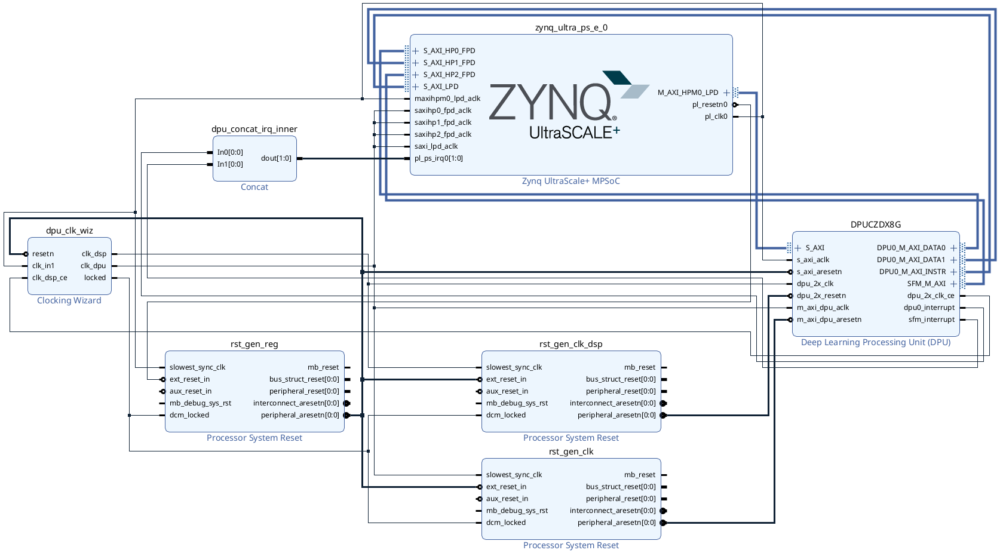</div>

1. 复位IP连线：
   1. rst_gen_reg
      - slowest_sync_clk连接至时钟IP的clk_in1
      - ext_reset_in连接至Zynq的pl_resetn0
      - dcm_locked连接至时钟IP的locked
      - peripheral_aresetn连接至时钟IP的resetn
   2. rst_gen_clk
      - slowest_sync_clk连接至时钟IP的clk_dpu
      - ext_reset_in连接至时钟IP的resetn
      - dcm_locked连接至时钟IP的locked
      - peripheral_aresetn连接至DPU IP的m_axi_dpu_aresetn
   3. rst_gen_clk_dsp
      - slowest_sync_clk连接至时钟IP的clk_dsp
      - ext_reset_in连接至时钟IP的resetn
      - dcm_locked连接至时钟IP的locked
      - peripheral_aresetn连接至DPU IP的dpu_2x_resetn
2. DPU IP
   - S_AXI连接Zynq M_AXI_HPM0_LPD
   - s_axi_aclk连接Zynq pl_clk0
   - ……

3. 其他连线参见图片

#### 分配地址

1. Diagram连线完毕后，切换到“Address Editor“下，先选中zynq_ultra_ps_e_0下的S_AXI，右键“Assign”。

<div align=center>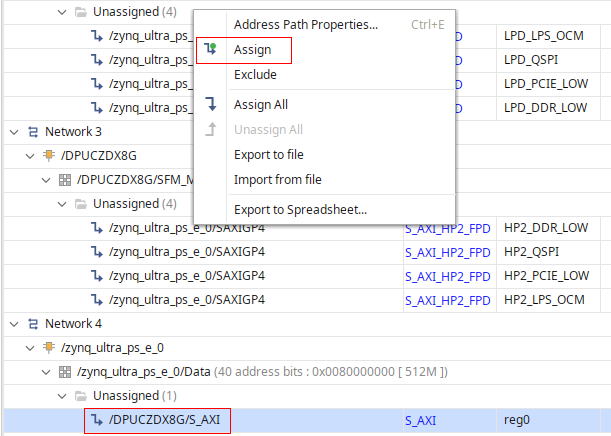</div>

2. 待S_AXI分配好后，点击上方“Assign All”，为其他总线分配地址。

<div align=center>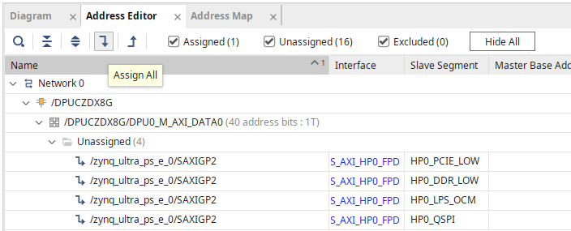</div>

3. 回到Diagram下，点击上方“Validate Design”对设计进行检查，无误会提示检查成功。

<div align=center></div>

### 生成顶层文件直到导出 `.xsa`

1. 左侧“Source”下，选中这个 `.bd` 设计，右键选择“Generate Output Products”，“Synthesis Options”选择”Out of context per IP”。

<div align=center></div>

2. 同样的步骤，选择“Create HDL Wrapper”，之后默认选项，这将生成一个顶层的 `.v` 文件。

<div align=center>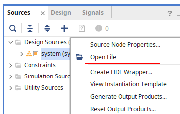</div>

3. 左侧“Flow Navigator”，点击最下方“Generate Bitstream”，会显示目前没有Implementation，点击Yes，默认设置继续。Vivado将自动完成综合、布局布线、生成比特流。

   *也可以在左侧“Flow Navigator”，分步完成“Run Synthesis”、“Run Inplementation”、“Generate Bitstream”*

<div align=center></div>

4. 软件左上角File->Export->Export Hardware，在“Output”页面选择“Include bitstream”，然后设置XSA文件名及导出路径，之后则可成功导出 `.xsa` 文件。

<div align=center>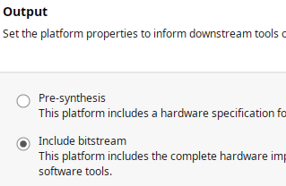</div>

## 基于Petalinux 2022.2创建并配置系统映像

### 环境及软件

1. Petalinux 2022.2，建议Ubuntu 20.04/22.04

  *注意：系统glibc版本过高会导致Petalinux构建失败，Petalinux 2022.2的建议是glibc 2.34，可使用 `ldd --version` 查看glibc版本。构建Petalinux需要良好的网络连接。

2. DPUCZDX8G_VAI_v3.0（其中DPU v4.1）。DPU IP及软件版本兼容性参见上一章节[环境及软件](#环境及软件)。

### [创建Petalinux工程](https://github.com/Xilinx/Vitis-AI/blob/3.0/dpu/ref_design_docs/README_DPUCZ_Vivado_sw.md)

1. 设置Petalinux工作区环境：

    ```shell
    source <PetaLinux_v2022.2_install_path>/settings.sh
    ```

2. 创建并配置工程，这样将在目录下创建名为 `PROJECT` 的工程目录。

    ```shell
    petalinux-create -t project -n <PROJECT> --template zynqMP
    ```

    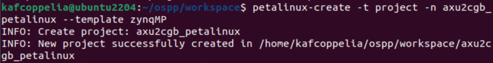

    之后进入该目录，并以 `xsa` 文件配置工程

    ```shell
    cd axu2cgb_petalinux
    petalinux-config --get-hw-description <PATH-TO-XSA> --silentconfig
    ```

    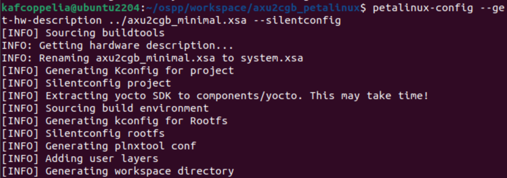

3. 由于是使用Vivado集成DPU的方式，需要复制 DPU TRD目录下，`$TRD_HOME/prj/Vivado/sw/meta-vitis/recipes-kernel` 至 `<PETALINUX-PROJECT-DIR>/project-spec/meta-user` 下，这其中包含DPU驱动补丁及DPU配置文件。

4. 输入 `petalinux-config -c kernel` ，进入menuconfig配置页面，找到如下选项并开启，保存并退出。此时在kernel内启用了DPU驱动。

    ``` shell
    Device Drivers -->
        Misc devices -->
            <*> Xilinux Deep learning Processing Unit (DPU) Driver
    ```

5. 使用recipes-vitis-ai，从而在构建Petalinux时将vitis ai library一并构建。

    1. 将vitis ai library添加到rootfs：复制 `$TRD_HOME/prj/Vivado/sw/meta-vitisrecipes-vitis-ai` 到 `<PETALINUX-PROJECT-DIR>/project-spec/meta-user` 下

    2. 将以下几行内容添加到 `<PETALINUX-PROJECT-DIR>/project-spec/meta-user/conf/user-rootfsconfig` 中

        ```shell
        CONFIG_vitis-ai-library
        CONFIG_vitis-ai-library-dev
        CONFIG_vitis-ai-library-dbg
        ```

        之后，运行 `petalinux-config -c rootfs` ，找到vitis-ai-library并选中启用。

        ```shell
        Select user packages --->
            Select [*] vitis-ai-library
        ```

6. 生成EXT4 rootfs：输入 `petalinux-config` ，选择root的文件系统为EXT4；同时将 `mmcblk0p2` 改为 `mmcblk1p2` ，因为AXU2CGB开发板SD1才为外接SD卡。

    ```shell
    Image Packaging Configuration --->
        Root filesystem type (EXT4 (SD/eMMC/SATA/USB))
        (/dev/mmcblk1p2) Device node of SD device
    ```

7. 修改设备树。进入到 `<PETALINUX-PROJECT-DIR>/project-spec/meta-user/recipes-bsp/device-tree/files` 目录下，修改 `system-user.dtsi` 为：

    ```dts
    /include/ "system-conf.dtsi"
    /{
    };
    /* SD */
    &sdhci1 {
        disable-wp;
        no-1-8-v;
    };
    /* USB */
    &dwc3_0 {
        status = "okay";
        dr_mode = "host";
    };
    ```

8. 编译。输入 `petalinux-build` 。编译完成后，终端如下图所示。

    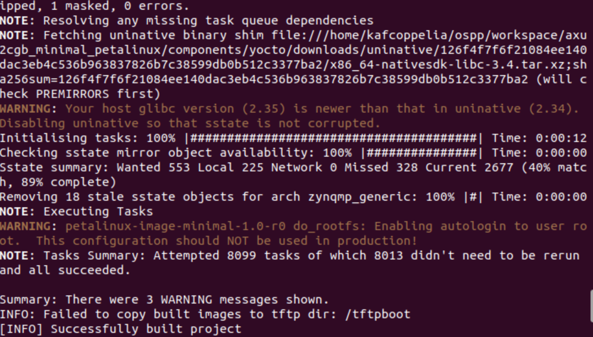

9. 创建启动映像、rootfs等文件。

    ```shell
    cd images/linux
    petalinux-package --boot --fsbl zynqmp_fsbl.elf --u-boot u-boot.elf --pmufw pmufw.elf --fpga system.bit --force
    ```

10. 将生成的 `BOOT.BIN`、`boot.scr`、`image.ub` 复制到SD卡 `/boot` FAT32分区，第二个分区存放根文件系统，EXT4，将 `rootfs.tar.gz` 解压后放入该分区。

11. 设置开发板为SD模式启动，上电。

## 基于黑金提供的示例的流程梳理

### 环境

Vitis AI v1.2、docker（并确保用户位于docker用户组内）、petalinux sdk 2020.1，黑金提供的 `SD_card.img`

参考：[UG1414](https://docs.xilinx.com/r/1.2-English/ug1414-vitis-ai)

1. [Vitis AI v1.2](https://github.com/Xilinx/Vitis-AI/tree/v1.2)

    ```shell
    git clone -b v1.2 --recurse-submodules https://github.com/Xilinx/Vitis-AI.git
    ```

2. 拉取Vitis AI docker，注意指定版本 `1.2.82`

    ```shell
    docker pull xilinx/vitis-ai:1.2.82
    ```

3. 安装交叉编译工具 Petalinux sdk 2020.1。

    1. 下载 [sdk-2020.1.0.0.sh](https://www.xilinx.com/bin/public/openDownload?filename=sdk-2020.1.0.0.sh)，并安装。之后通过 `source` 可启动该环境

        ```shell
        bash ./sdk-2020.1.0.0.sh
        
        bash <PATH-TO-PETALINUX-SDK>/environment-setup-aarch64-xilinx-linux
        ```

    2. 下载 [vitis_ai_2020.1-r1.2.0.tar.gz](https://www.xilinx.com/bin/public/openDownload?filename=vitis_ai_2020.1-r1.2.0.tar.gz)，解压并安装到SDK内。

        ```shell
        tar -xzvf vitis_ai_2020.1-r1.2.x.tar.gz -C ~/petalinux_sdk/sysroots/aarch64-xilinx-linux
        ```

        在此之后，对于Vitis AI的应用，使用该交叉编译工具完成在x86_64主机上对aarch64程序的编译。

    3. 要验证交叉编译工具是否安装成功，可尝试编译Vitis AI Library内的应用程序，例如：

        ```shell
        cd ./Vitis-AI/Vitis-AI-Library/overview/demo/yolov3
        bash -x build.sh
        ```

        如果没有报错，则成功。

### 应用示例

1. 模型下载。Vitis AI应用使用的模型，需要经过量化、结合DPU硬件规格信息（ `.json`、`.dcf` ）后编译生成 `.elf` 模型文件以供应用调用DPU进行加速。

    以使用 [tf_resnetv1_50_imagenet_224_224_6.97G_1.2](https://www.xilinx.com/bin/public/openDownload?filename=tf_resnetv1_50_imagenet_224_224_6.97G_1.2.zip) 模型、运行 `Vitis-AI/VART/samples/resnet50/src/main.cc` 图片分类任务为例。模型文件参考 `./Vitis-AI/AI-Model-Zoo/README.md`  内的说明，该模型对应编号47。

    下载后，目录 `tf_resnetv1_50_imagenet_224_224_6.97G_1.2/quantized` 下 `deploy_model.pb` 则为量化后的模型。

2. 模型编译。

    1. 准备DPU的架构文件。将黑金的 `AXU2CGB_DPU_B1152` 文件夹复制到 `Vitis-AI/AI-Model-Zoo` 目录下（或者任意位置），其中含有 `.json` 与 `.dcf`。并修改 `AXU2CGB_DPU_B1152.json` 文件中的dcf路径：

        ```json
        {
            "target"   : "DPUCZDX8G",
            "dcf"      : "./AI-Model-Zoo/AXU2CGB_DPU_B1152/AXU2CGB_DPU_B1152.dcf",
            "cpu_arch" : "arm64"
        }
        ```

    2. 在Vitis AI目录下，进入docker环境

        ```shell
        ./docker_run.sh xilinx/vitis-ai:1.2.82
        ```

        在docker内，激活conda环境，并编译模型，指定量化后的模型 `.pb`、模型名称、DPU架构文件

        ```shell
        $ conda activate vitis-ai-tensorflow
        $ vai_c_tensorflow --frozen_pb ./AI-Model-Zoo/tf_resnetv1_50_imagenet_224_224_6.97G_1.2/quantized/deploy_model.pb --net_name resnet50_tf --arch ./AI-Model-Zoo/AXU2CGB_DPU_B1152/AXU2CGB_DPU_B1152.json --output_dir ./compiled_model --quant_info
        ```

    3. 终端将输出：

        ```bash
        **************************************************
        * VITIS_AI Compilation - Xilinx Inc.
        **************************************************
        [VAI_C][Warning] layer [resnet_v1_50_SpatialSqueeze] (type: Squeeze) is not supported in DPU, deploy it in CPU instead.
        [VAI_C][Warning] layer [resnet_v1_50_predictions_Softmax] (type: Softmax) is not supported in DPU, deploy it in CPU instead.
        
        Kernel topology "resnet50_tf_kernel_graph.jpg" for network "resnet50_tf"
        kernel list info for network "resnet50_tf"
                                       Kernel ID : Name
                                               0 : resnet50_tf_0
                                               1 : resnet50_tf_1
        
                                     Kernel Name : resnet50_tf_0
        --------------------------------------------------------------------------------
                                     Kernel Type : DPUKernel
                                       Code Size : 1.00MB
                                      Param Size : 24.35MB
                                   Workload MACs : 6964.51MOPS
                                 IO Memory Space : 2.25MB
                                      Mean Value : 0, 0, 0, 
                              Total Tensor Count : 59
                        Boundary Input Tensor(s)   (H*W*C)
                                      input:0(0) : 224*224*3
        
                       Boundary Output Tensor(s)   (H*W*C)
                 resnet_v1_50_logits_Conv2D:0(0) : 1*1*1000
        
                                Total Node Count : 58
                                   Input Node(s)   (H*W*C)
                    resnet_v1_50_conv1_Conv2D(0) : 224*224*3
        
                                  Output Node(s)   (H*W*C)
                   resnet_v1_50_logits_Conv2D(0) : 1*1*1000
        
                                     Kernel Name : resnet50_tf_1
        --------------------------------------------------------------------------------
                                     Kernel Type : CPUKernel
                        Boundary Input Tensor(s)   (H*W*C)
                resnet_v1_50_SpatialSqueeze:0(0) : 1*1*1000
        
                       Boundary Output Tensor(s)   (H*W*C)
           resnet_v1_50_predictions_Softmax:0(0) : 1*1*1000
        
                                   Input Node(s)   (H*W*C)
                     resnet_v1_50_SpatialSqueeze : 1*1*1000
        
                                  Output Node(s)   (H*W*C)
                resnet_v1_50_predictions_Softmax : 1*1*1000
        ```

    4. 在 `compiled_model` 目录下，有 `.gv` 与 `.elf` 文件，其中 `dpu_resnet50_tf_0.elf` 为编译后的模型，该文件将在应用程序中调用。

3. 应用程序编译。启动交叉编译工具链，进入 `./Vitis-AI/VART/samples/resnet50` 目录：

    ```shell
    bash <PATH-TO-PETALINUX-SDK>/environment-setup-aarch64-xilinx-linux
    cd Vitis-AI/VART/samples/resnet50
    bash -x build.sh
    ```

    最终生成可执行文件 `resnet50` 。

### 上机

1. 使用Balena Etcher等SD卡烧录工具，将黑金提供的 `SD_card.img` 映像烧录至SD卡。之后，SD卡会有 `boot` 分区（FAT32）与 `rootfs` 分区（EXT4）。对于EXT4分区，其大小可以根据应用的资源需要，选择扩容。

2. 资源准备。

    1. 将VART rpm包提前复制到SD卡rootfs分区内。（下述文件准备可使用scp）下载 [vitis-ai-runtime-1.2.x.tar.gz](https://www.xilinx.com/bin/public/openDownload?filename=vitis-ai-runtime-1.2.0.tar.gz)

        参考文档：[ug1354 v1.2/Installing-AI-Library-Package](https://docs.xilinx.com/r/1.2-English/ug1354-xilinx-ai-sdkStep-3-Installing-AI-Library-Package)

        ```shell
        tar -xzvf vitis-ai-runtime-1.2.x.tar.gz
        sudo cp -r vitis-ai-runtime-1.2.x/aarch64/centos <PATH-TO-ROOTFS>/home/root/
        ```

    2. 下载 [vitis_ai_runtime_r1.2.0_image_video.tar.gz](https://www.xilinx.com/bin/public/openDownload?filename=vitis_ai_runtime_r1.2.0_image_video.tar.gz) ，解压后为一个 `samples` 目录，我们的应用示例仅会用到 `images` 目录下的图片，但需要保持这个目录层级（可在应用程序的相应部分修改、重新编译）。新建 `samples/resnet50` 目录，并将可执行文件 `resnet50` 与 `word.txt` 均复制到该目录下。同时将 `dpu_resnet50_tf_0.elf` 模型文件复制到 `samples` 目录下。最后将 `samples` 复制到rootfs分区内。

        ```shell
        sudo cp -r samples <PATH-TO-ROOTFS>/home/root/Vitis-AI/VART/
        ```

3. 将开发板调成SD启动模式，插入SD卡，启动。

4. 安装VART。

    ```shell
    cd ~/centos
    rpm -ivh --force libunilog-1.2.0-r10.aarch64.rpm
    rpm -ivh --force libxir-1.2.0-r12.aarch64.rpm
    rpm -ivh --force libtarget-factory-1.2.0-r10.aarch64.rpm
    rpm -ivh --force libvart-1.2.0-r16.aarch64.rpm
    ```

5. 修改 `vart.conf`。安装完VART后，`/etc/vart.conf` 文件将指向 `dpu.xclbin`，需修改路径，使其能找到 `dpu.xclbin`。

    ```shell
    echo "firmware: /media/sd-mmcblk1p1/dpu.xclbin" > /etc/vart.conf
    ```

    *注意是 `sd-mmcblk1p1`

6. 运行程序，并指定 `.elf` 模型文件的路径，程序将自动读取位于 `../images` 下的图片，并根据 `./words.txt` 的类别给出分类结果。

    ````shell
    cd ~/Vitis-AI/VART/samples/resnet50
    ./resnet50 <PATH-TO-MODEL>/dpu_resnet50_tf_0.elf
    ````

    例如：

    ```bash
    root@zynqmp-common-2020_1:~/Vitis-AI/samples/resnet50# ./resnet50 ../dpu_resnet50_tf_0.elf
    WARNING: Logging before InitGoogleLogging() is written to STDERR
    I0528 14:11:07.966706   713 main.cc:288] create running for subgraph: resnet50_tf_0
    [   73.177126] [drm] Pid 713 opened device
    [   73.180999] [drm] Pid 713 closed device
    [   73.184937] [drm] Pid 713 opened device
    [   73.188780] [drm] Pid 713 closed device
    [   73.267527] [drm] Pid 713 opened device
    [   73.271410] [drm] Pid 713 closed device
    [   73.281589] [drm] Pid 713 opened device
    [   73.285520] [drm] Pid 713 closed device
    [   73.330933] [drm] Pid 713 opened device
    [   73.334880] [drm] Finding IP_LAYOUT section header
    [   73.334882] [drm] Section IP_LAYOUT details:
    [   73.339673] [drm]   offset = 0x54fd18
    [   73.343938] [drm]   size = 0x58
    [   73.347599] [drm] Finding DEBUG_IP_LAYOUT section header
    [   73.350734] [drm] AXLF section DEBUG_IP_LAYOUT header not found
    [   73.356039] [drm] Finding CONNECTIVITY section header
    [   73.361948] [drm] Section CONNECTIVITY details:
    [   73.366992] [drm]   offset = 0x54fd70
    [   73.371513] [drm]   size = 0x7c
    [   73.375174] [drm] Finding MEM_TOPOLOGY section header
    [   73.378310] [drm] Section MEM_TOPOLOGY details:
    [   73.383354] [drm]   offset = 0x54fbf8
    [   73.387875] [drm]   size = 0x120
    [   73.391546] [drm] Download new XCLBIN C5C1F682-9C76-40F5-AA5C-7994437F69E9 done.
    [   73.394774] [drm] zocl_xclbin_read_axlf c5c1f682-9c76-40f5-aa5c-7994437f69e9 ret: 0.
    [   73.409898] [drm] -> Hold xclbin C5C1F682-9C76-40F5-AA5C-7994437F69E9, from ref=0
    [   73.417637] [drm] <- Hold xclbin C5C1F682-9C76-40F5-AA5C-7994437F69E9, to ref=1
    [   73.425160] [drm] No ERT scheduler on MPSoC, using KDS
    [   73.437648] [drm] scheduler config ert(0)
    [   73.437650] [drm]   cus(1)
    [   73.441651] [drm]   slots(16)
    [   73.444356] [drm]   num_cu_masks(1)
    [   73.447317] [drm]   cu_shift(16)
    [   73.450796] [drm]   cu_base(0x80000000)
    [   73.454017] [drm]   polling(0)
    [   73.457868] [drm] -> Release xclbin C5C1F682-9C76-40F5-AA5C-7994437F69E9, from ref=1
    [   73.460911] [drm] now xclbin can be changed
    [   73.468656] [drm] <- Release xclbin C5C1F682-9C76-40F5-AA5C-7994437F69E9, to ref=0
    [   73.473175] [drm] Pid 713 opened device
    [   73.484635] [drm] -> Hold xclbin C5C1F682-9C76-40F5-AA5C-7994437F69E9, from ref=0
    
    Image : 001.jpg
    top[0] prob = 0.493322  name = lampshade, lamp shade
    top[1] prob = 0.110075  name = sea anemone, anemone
    top[2] prob = 0.051996  name = wig
    top[3] prob = 0.040494  name = coil, spiral, volute, whorl, helix
    top[4] prob = 0.031537  name = vase
    
    (Classification of ResNet50:713): Gtk-[1;33mWARNING[0m **: [34m14:11:08.525[0m: cannot open display: 
    [   73.484638] [drm] <- Hold xclbin C5C1F682-9C76-40F5-AA5C-7994437F69E9, to ref=1
    [   73.694025] [drm] -> Release xclbin C5C1F682-9C76-40F5-AA5C-7994437F69E9, from ref=1
    [   73.701329] [drm] now xclbin can be changed
    [   73.709066] [drm] <- Release xclbin C5C1F682-9C76-40F5-AA5C-7994437F69E9, to ref=0
    [   73.713247] [drm] Pid 713 closed device
    [   73.724863] [drm] Pid 713 closed device
    ```

### 项目遇到的问题

#### 基于Vitis AI v3.0流程系统映像无法启动

Vitis AI版本迭代快速。相较于之前的版本，新版在开发流程的难易程度、稳定性、适用性上更胜一筹。适用于Zynq UltraScale+ MPSoC开发板的最新版本为v3.0，相较于v1.2，新版对我们项目的好处在于：

|                   v3.0                   |               v1.2               |
| :--------------------------------------: | :------------------------------: |
|         流程更新，部分流程更简单         |      流程较老，部分流程繁琐      |
|      参考文档更全面、易于概念的理解      | 参考文档较少，概念与新版存在差异 |
| 功能上，适配PyTorch、TF2等更为常用的框架 |      仅适配TF1、Caffe等框架      |
|    功能更加成熟，移植新版的适用性更佳    |   功能不全，移植老版的价值更低   |

因此，我们首先基于Vitis AI v3.0展开研究与开发工作。基于Vitis Ai v3.0与Vivado 2022.2，实现了DPU硬件的配置与集成，并通过Petalinux将其编译至系统内，最终生成了系统映像。该部分工作参见上述已完成工作。

在部署至开发板并启动的过程中，我们遇到了严重的问题。这导致开发板无法正常启动，因此无法进行后续模型的部署与最终的应用推理。对此，我们对全开发流程进行了仔细的排查，包括：

1. Vivado 2022.2下，开发板硬件（包括DPU）的配置与集成；
2. 使用Petalinux 2022.2，配置系统时的设置；
3. 最终生成的系统映像，其启动文件、设备树等设置是否正确；

同时，我们将错误复现及一些有用的日志文件等信息记录了下来，将问题反馈至开发板厂商，同时在赛灵思官方论坛上进行求助，该问题参见：[Stuck when booting Petalinux image from SD card with custom zynqmp board and DPU IP in Vivado Integration](https://support.xilinx.com/s/feed/0D54U00007K4jRMSAZ?language=en_US)

受限于项目的时间规划，由于对该问题的解决无明显进展，因此，我们最终放弃了基于Vitis AI v3.0的开发方案。转向使用参考资料较多的Vitis AI v1.2版本进行开发与移植。

#### VART/DNNDK源代码及版本差异

鉴于使用v3.0可以实现DPU硬件集成，但开发板无法启动。因此，我们使用黑金提供的基于Vitis AI v1.2可用的系统映像，其内已集成了特定配置的DPU硬件，因此我们可以简化研究步骤，在此基础上直接研究VART运行时等开发流程与架构之间的联系。

在我们需要获取与DPU关联的软件运行时时，我们发现赛灵思在[Vitis AI v1.2仓库](https://github.com/Xilinx/Vitis-AI/tree/1.2)下未开源其VART源代码，因此我们无法获取该部分源代码，并整合至RT Smart内，从而编译成最终系统。

解决方案：尝试切换至[v1.3版本](https://github.com/Xilinx/Vitis-AI/tree/v1.3/tools/Vitis-AI-Runtime/VART)，VART v1.3版本包含如下4个模块：

1. unilog
2. xir
3. target_factory
4. vart

模块间耦合较多，相互存在依赖关系，因此难以拆分。若拆分需要修改大多数源代码，成本较高，且编译阶段会出现难以预测的问题。将v1.3与v1.2版本的开发流程进行比较，两版本的VART所承担的功能差异不明显，因此可尝试在黑金提供的v1.2系统映像中，将应用程序用v1.3版本的VART进行交叉编译并运行。

尝试该方案，原运行在v1.2运行时上的应用程序亦可在v1.3版本运行时上正常推理。因此，可以采用VART v1.3版本的源代码进行移植工作。

#### 移植DPU驱动至RT Smart

待确定移植的VART版本后，我们对源码进行了分析。发现其依赖的库多且复杂，具体存在如下几方面的困难阻碍我们将其移植到RT Smart：

1. 模块间耦合较多，相互存在依赖关系。例如，编译 `vart` ，依赖 `unilog` 、 `target_factory` ；
2. 依赖第三方库，例如 `unilog` 内部依赖 `glog` ，`target_fatory` 依赖 `protobuf` 等；
3. RT Smart使用的交叉编译工具链aarch64-linux-musleabi_for_x86_64-pc-linux-gnu缺少部分头文件，需要额外找齐；
4. RT Smart使用scons组织目录与管理编译，而VART内使用CMake管理编译，难以用scons完全替代。

限于时间规划，放弃完整移植VART。转而仅移植DPU驱动相关的源代码，若能将该部分代码使用aarch64-linux-musleabi_for_x86_64-pc-linux-gnu编译成动态库，后续即可加载至RT Smart系统内，并实现对DPU硬件的控制。

经分析，v1.3版本的Vitis AI，依旧使用DNNDK（深度神经网络开发套件）运行时框架驱动DPU。在DNNDK之上，是C++/Python的编程接口，其内部负责DPU的加载、调度、追踪等。其中，与DPU驱动相关的源代码包括：`dpucore.c`、`dpucore.h`、`dpudef.h`，具体参见链接：[DNNDK/driver](https://github.com/EmbeddedCamerata/Vitis-AI/tree/v1.3%2B/tools/Vitis-AI-Runtime/DNNDK/driver)。

#### DPU驱动头文件

上述与DPU驱动相关的源代码所依赖的头文件大多是Linux下的头文件，无法直接使用RT Smart所使用的aarch64-linux-musleabi_for_x86_64-pc-linux-gnu交叉编译工具进行编译。头文件依赖主要在 `dpucore.h` 中。下表总结了大部分依赖的头文件及其功能描述。

|            头文件            |                     使用举例                      |           功能描述           |
| :--------------------------: | :-----------------------------------------------: | :--------------------------: |
|        linux/mutex.h         |                     semaphore                     |           信号相关           |
|            asm/\*            |                     atomic_t                      |         多线程原子锁         |
| linux/mm.h->linux/mm_types.h |                  vm_area_struct                   |     虚拟地址空间区域相关     |
|   linux/platform_device.h    |      platform_device, struct platform_driver      |       设备资源信息相关       |
|      linux/interrupt.h       |            irqreturn_t, irq_handler_t             |           中断相关           |
|          linux/of.h          | of_find_compatible_node(), of_get_property(), etc | `of_` 开头的函数均在此头文件 |
|         linux/list.h         |                     list_head                     |             链表             |
|     linux/dma-mapping.h      |              dma_addr_t, phys_addr_t              |             DMA              |
|         linux/wait.h         |    wait_queue_head_t, wake_up_interruptible()     |       内核等待队列相关       |
|          linux/fs.h          |        inode, file, struct file_operations        |       字符驱动设备相关       |
|              /               |                    char __user                    |            特殊宏            |
|           asm/io.h           |              iowrite32(), ioremap()               |      内核读写寄存器相关      |
|        linux/delay.h         |                     udelay()                      |          内核级延迟          |
|      linux/miscdevice.h      |        struct miscdevice, misc_register()         |     注册字符设备驱动程序     |

一种可行的解决方案是寻求用musl libc库，或者Posix的头文件进行替代，并尝试编译，但这其中涉及较为底层的实现。
