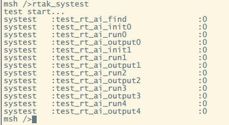

<center><h1> 测试用例</h1></center>

# 快速开始

遵循 BDD 和 Pytest 开发规范.

```shell
# 在运行测试用例之前
$ cd RTAK/test
$ pip3 install -r requirements.txt
```

## stm32 测试用例

### RT-AK Tools 测试用例

**测试数据:**

- `model`: `./rt_ai_tools/Models/keras_mnist.h5`
- `platform` : `stm32`
- `RT-AK Lib` : `rt_ai_lib`
- `firmware`: `rtthread.bin`

**测试对象:**

- `RT-AK Tools`: `rt_ai_tools/ai_tools.py`

**测试过程:**

```shell
# 代码会自动下载 STM32: X-CUBE-AI 和 BSP
$ cd RTAK/test
$ pytest step_defs/test_u1s1.py
```

在 `BSP` 路径下生成 `rtthread.bin` 固件之后, 视作测试成功, 自动删除临时工作文件.

目前测试用例仅支持模型文件名为 `mnist`，如果模型文件名不是 `mnist`，则将在第三步报错，编译失败，之后会烧录上一次编译成功的固件或者烧录失败。

**功能**

- [X] 模型部署
- [X] 增加 rt_ai_libs 测试用例
- [ ] BSP 编译
- [ ] 固件烧录

### RT-AK Lib 测试步骤

开启测试: 设置@file: systest_mnist.c 中的`#if 0` -> `#if 1` 

编译->烧录

在shell中运行命令"rtak_systest";

log信息: 测试类型 : 测试函数 : 测试结果

测试结果说明: 0:成功, other:失败



