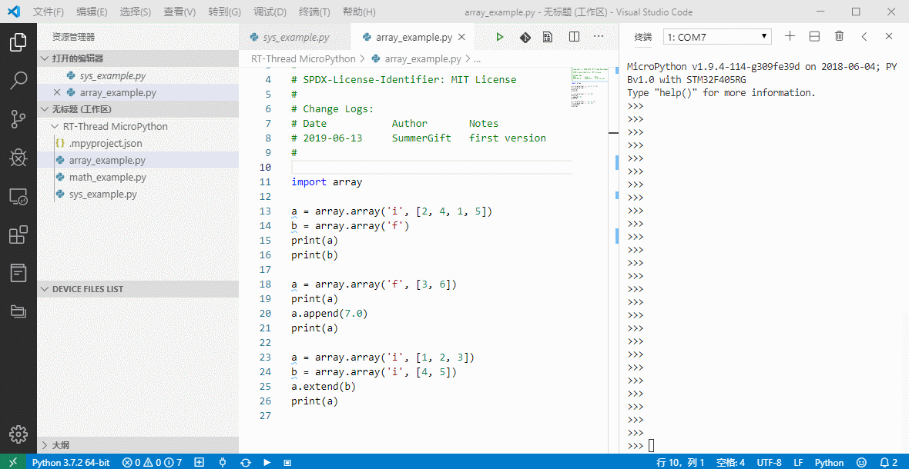

# MicroPython

[中文页](README_ZH.md) | English

## 1. Introduction

This is a port of `MicroPython` on RT-Thread, which can run on **RT-Thread 3.0** or higher. This software package can run `MicroPython` on embedded systems equipped with RT-Thread.

If it is the first time to come into contact with RT-Thread MicroPython, it is recommended that you use RT-Thread officially supported development boards to get started quickly. These development boards have complete firmware functions and provide source code, suitable for introductory learning, and officially support development boards [firmware download Please click on me](https://www.rt-thread.org/qa/forum.php?mod=viewthread&tid=12305&extra=page%3D1%26filter%3Dtypeid%26typeid%3D20).

### 1.1 Directory structure

| Name | Description |
| ---- | ---- |
| docs | Document directory, including getting started guide and development manual |
| drivers | MicroPython source code directory |
| extmod | MicroPython Source Code Directory |
| lib | MicroPython source code directory |
| py | MicroPython source code directory |
| port | Porting code directory |
| LICENSE | Micropython MIT License |

### 1.2 License

RT-Thread MicroPython follows the MIT license, see the `LICENSE` file for details.

### 1.3 Dependency

- RT-Thread 3.0+

## 2. How to open RT-Thread MicroPython

To use `MicroPython package`, you need to select it in the RT-Thread package manager. The specific path is as follows:

Then let the RT-Thread package manager automatically update, or use the `pkgs --update` command to update the package to the BSP.

## 3. Use RT-Thread MicroPython

### 3.1 Add software package to project

After selecting `MicroPython package`, when compiling with `bsp` again, it will be added to the `bsp` project for compilation.

* For firmware development, please refer to [《MicroPython Firmware Development Guide》](./docs/firmware-develop.md)

* For more MicroPython documentation, please visit [RT-Thread Documentation Center](https://www.rt-thread.org/document/site/submodules/micropython/docs/introduction/)

### 3.2 Using MicroPython IDE

[RT-Thread MicroPython IDE](https://marketplace.visualstudio.com/items?itemName=RT-Thread.rt-thread-micropython) provides a powerful development environment for MicroPython, which can be directly searched and downloaded through the VScode application store. Examples are as follows:

### 3.3 Add C extension to MicroPython

In order to facilitate users to add their own C functions to MicroPython to be called by Python scripts, RT-Thread provides [MicroPython C binding code automatic generator](https://summerlife.github.io/RT-MicroPython-Generator/) For everyone to use. With this tool, users only need a few simple steps to achieve C function extension. The following figure shows the form of the automatically generated C code.

## 4. Matters needing attention

- Need to use **RT-Thread 3.0** or above
- Select the `latest` version of `Micropython` in the `menuconfig` option
- Currently, the `ffi` module under `System Module` only supports GCC toolchain, and relevant information needs to be added to the link script

## 5. Development resources

* [RT-Thread MicroPython Forum](https://www.rt-thread.org/qa/forum.php)
* [RT-Thread MicroPython Documentation Center](https://www.rt-thread.org/document/site/submodules/micropython/docs/introduction/)
* [Click to join the RT-Thread MicroPython exchange group](https://jq.qq.com/?_wv=1027&k=5EhyEjx)
