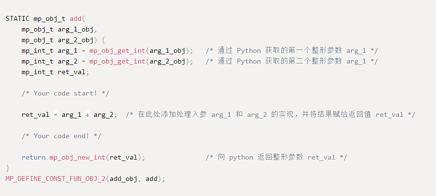

# MicroPython

中文页 | [English](README.md)

## 1、介绍

这是一个在 RT-Thread 上的 `MicroPython` 移植，可以运行在 **RT-Thread 3.0** 版本以上。通过该软件包可以在搭载了 RT-Thread 的嵌入式系统上运行 `MicroPython`。

如果是第一次接触 RT-Thread MicroPython，推荐你先通过 RT-Thread 官方支持的开发板来快速上手，这些开发板的固件功能完善并提供源代码，适合入门学习，官方支持开发板 [固件下载请点我](https://www.rt-thread.org/qa/forum.php?mod=viewthread&tid=12305&extra=page%3D1%26filter%3Dtypeid%26typeid%3D20)。

### 1.1 目录结构

| 名称 | 说明 |
| ---- | ---- |
| docs  | 文档目录，包括入门指南和开发手册 |
| drivers | MicroPython 源代码目录 |
| extmod | MicroPython 源代码目录 |
| lib | MicroPython 源代码目录 |
| py | MicroPython 源代码目录 |
| port | 移植代码目录 |
| LICENSE | Micropython MIT 许可证 |

### 1.2 许可证

RT-Thread MicroPython  遵循 MIT 许可，详见 `LICENSE` 文件。

### 1.3 依赖

- RT-Thread 3.0+

## 2、如何打开 RT-Thread MicroPython

使用 `MicroPython package` 需要在 RT-Thread 的包管理器中选择它，具体路径如下：

然后让 RT-Thread 的包管理器自动更新，或者使用 `pkgs --update` 命令更新包到 BSP 中。

## 3、使用 RT-Thread MicroPython

### 3.1 添加软件包到工程

选中 `MicroPython package` 后，再次进行 `bsp` 编译时，它会被加入到 `bsp` 工程中进行编译。

* 固件开发可参考 [《MicroPython 固件开发指南》](./docs/firmware-develop.md)

* 查阅更多 MicroPython 说明文档请访问 [RT-Thread 文档中心](https://www.rt-thread.org/document/site/submodules/micropython/docs/introduction/)

### 3.2 使用 MicroPython IDE

[RT-Thread MicroPython IDE](https://marketplace.visualstudio.com/items?itemName=RT-Thread.rt-thread-micropython) 为 MicroPython 提供了强大的开发环境，可以通过 VScode 应用商店直接查询下载，示例如下所示：

### 3.3 向 MicroPython 添加 C 扩展

为了方便用户添加自己编写的 C 函数到 MicroPython 中被 Python 脚本调用，RT-Thread 提供了 [MicroPython C 绑定代码自动生成器](https://summerlife.github.io/RT-MicroPython-Generator/) 供大家使用。通过该工具，用户只需要简单几步，即可实现 C 函数扩展，下图展示了自动生成的 C 代码的形式。

## 4、注意事项

- 需要使用 **RT-Thread 3.0** 以上版本
- 在 `menuconfig` 选项中选择 `Micropython` 的 `latest` 版本
- 目前 `System Module` 下的 `ffi` 模块只支持 GCC 工具链，且需要在链接脚本中添加相关段信息

## 5、开发资源

* [RT-Thread MicroPython 论坛](https://www.rt-thread.org/qa/forum.php)
* [RT-Thread MicroPython 文档中心](https://www.rt-thread.org/document/site/submodules/micropython/docs/introduction/)
* [点击加入 RT-Thread MicroPython 交流群](https://jq.qq.com/?_wv=1027&k=5EhyEjx)
