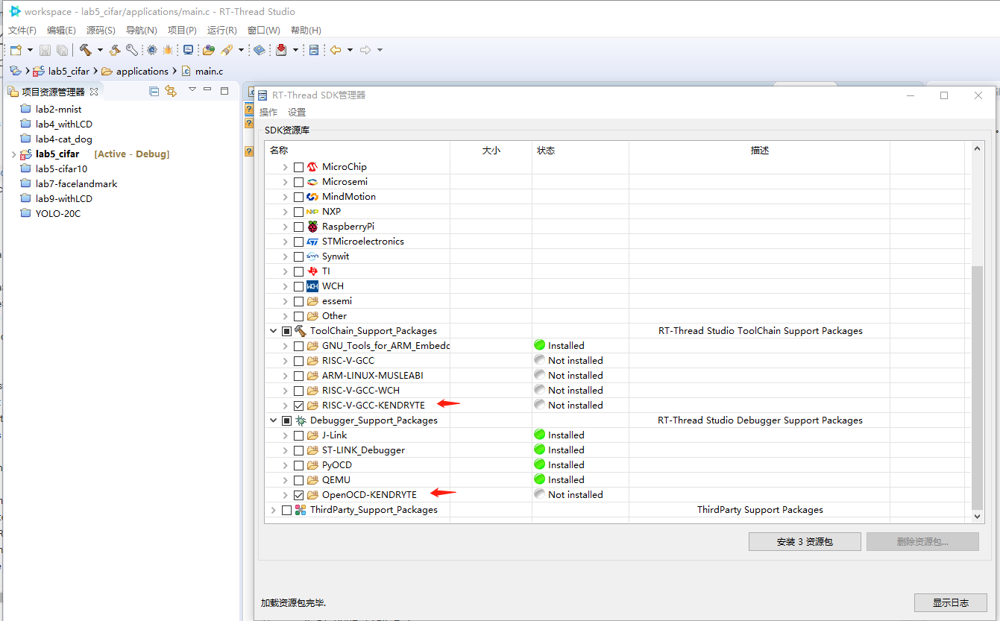
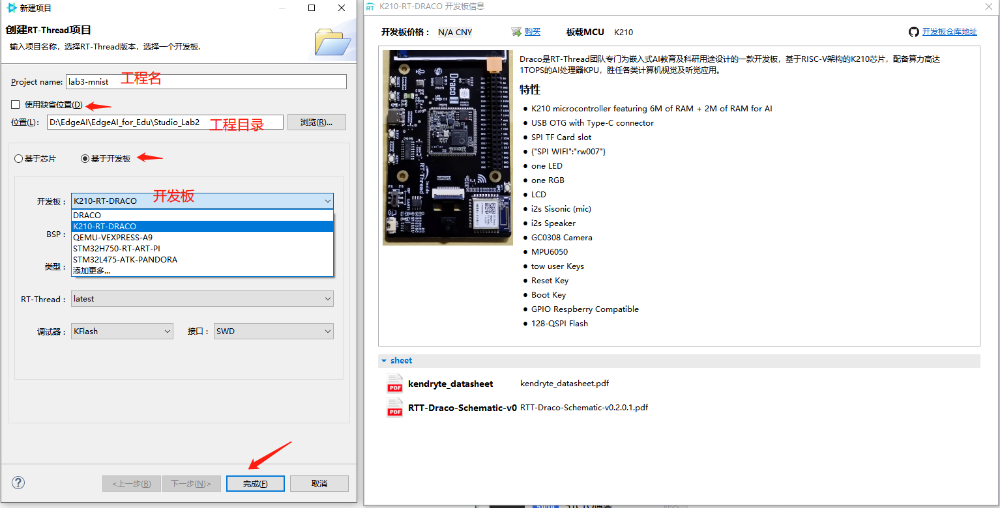
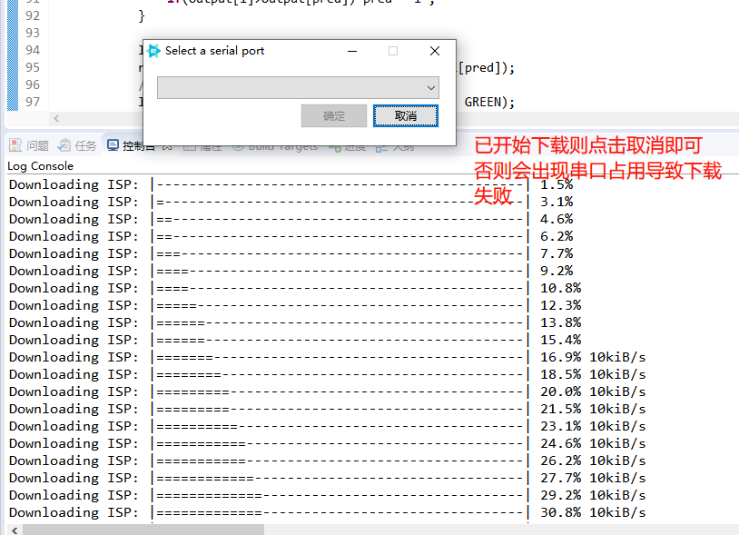

# Kendryte K210板级支持包说明
## 前言
本工程针对基于RT-Draco K210 嵌入式AI教育开发板专门定制。并进行持续更新。

**开发板模块展示:**

### 更新记录:

#### 	1.0.0

...

#### 	1.0.1

....

#### 	1.0.2

....

#### 	1.0.3(当前版本)

* 添加RT-AK MicroPython支持
* 添加MicroPython K210拓展模块及Image模块, 包含摄像头的MicroPython对接.
* **将文件夹`board_config`进行内置, 避免手动复制.** 此更新版本下用户无需再再复制baord_config文件夹.

## 1. 简介

Kendryte K210 是集成机器视觉与机器听觉能力的系统级芯片(SoC)。使用台积电 (TSMC) 超低功耗的 28 纳米先进制程，具有双核64位处理器，拥有较好的功耗性能，稳定性与可靠性。该方案力求零门槛开发，可在最短时效部署于用户的产品中，赋予产品人工智能。

Kendryte K210 定位于AI与IoT市场的SoC，同时是使用非常方便的MCU。

Kendryte中文含义为勘智，而勘智取自勘物探智。这颗芯片主要应用领域为物联网领域，在物联网领域进行开发，因此为勘物；这颗芯片主要提供的是人工智能解决方案，在人工智能领域探索，因此为探智。

* 具备机器视觉能力
* 具备机器听觉能力
* 更好的低功耗视觉处理速度与准确率
* 具备卷积人工神经网络硬件加速器KPU，可高性能进行卷积人工神经网络运算
* TSMC 28nm先进制程，温度范围-40°C到125°C，稳定可靠
* 支持固件加密，难以使用普通方法破解
* 独特的可编程IO阵列，使产品设计更加灵活
* 低电压，与相同处理能力的系统相比具有更低功耗
* 3.3V/1.8V双电压支持，无需电平转换，节约成本

芯片规格包括如下：

| 硬件     | 描述                                                         |
| -------- | ------------------------------------------------------------ |
| 芯片型号 | K210                                                         |
| CPU      | 双核RV64GC                                                   |
| 主频     | 400MHz                                                       |
| 片内SRAM | 8MB（6M通用+2M AI）                                          |
| 外设     | DVP、JTAG、OTP、FPIOA、GPIO、UART、SPI、RTC、I²S、I²C、WDT、Timer与PWM、内嵌AES与SHA256算法加速器 |

## 2. Studio开发环境

端侧部署分为工程准备、编译链接、系统烧录三步。工程准备基于 RT-AK 的 K210 插件，详见实验一。

下载并安装 RT-Thread Studio完成后，下面实现一个简单的工程创建的流程：

### Studio配置

此章节为更新Studio到最新版本，并配置工程模板教程，若用户当前Studio环境中没有 `K210-RT-DRACO` sdk的模板工程，可参考此章节进行模板导入。若此前已经进行过导入，则可过此节直接进行工程创建。

1. 打开桌面上的RT-Thread-Studio。

   

2. 若Studio弹框提示 `可用的更新`，一直点击下一步。

   

   直到勾选 `接收许可协议`，然后点击完成：

   

3. 若安装过程中提示如下图所示，点击 `install anyway`:

   

   可在右下角查看安装正在进行:

   

4. 安装完成后提示 `Restart Now`点击进行重启:

   

5. 点击Studio界面菜单栏下方的 `SDK Manager->勾选K210-RT-DRACO`:

   

   然后继续勾选编译器和调试器如下图:

   

   最后点击 `安装资源包` 等待安装完成:

   

### 从模板创建工程

1. 打开桌面上的RT-Thread-Studio。

   

2. 打开Studio界面后，点击左上角 `文件->新建->RT-Thread项目`。

   

3. 在新建项目界面选择 `基于开发板` ，输入 `Project name`和要创建工程的位置路径，然后点击 `完成`。

   

4. 每次创建完新的工程或添加新的代码文件或软件包后，进行刷新工程可将文件添加到工程目录中。操作如下所示，先右键点击项目，点击更新软件包，然后再次邮件点击项目，点击刷新：

   

5. 若代码中注释出现乱码现象，可以点击界面左上角 `窗口->首选项`。如下图所示：

   

   点击 `工作空间`，设置 `文本文件编码` ，编码设置为 `UTF-8`即可。

   

6. 工程创建完成，IDE界面基本功能按钮如下图：

   

## 3. 编译与下载

   1. 参考4.2节中，界面展示的说明。点击上方编译图标进行编译：

      

   2. 点击下载，第一次下载通常会弹出端口选择框，进行选择即可：

      

      下载成功如下所示:

      
      
      ***注意: 若点击下载时控制台已经开始下载时再次弹出串口选择框，则需要点击取消，或者可能出现串口占用。***
      
      
      
   3. 下载完成后打开串口，可查看交互信息：

      

   4. 串口打开成功，打印出RT-Thread LOGO和msh命令行：

      
      
      ***注意: 若下载时出现 `请选择正确串口`，可能是由于串口被占用导致，需检查并关闭占用串口的窗口。***
      
      

   **其它相关工具参考链接:**
   交叉编译工具链，[下载地址 https://github.com/xpack-dev-tools/riscv-none-embed-gcc-xpack/releases/tag/v8.3.0-1.2 ](https://github.com/xpack-dev-tools/riscv-none-embed-gcc-xpack/releases/tag/v8.3.0-1.2)

   或者: [https://github.com/kendryte/K210-Micropython-OpenMV/tree/master/toolchain](https://github.com/kendryte/K210-Micropython-OpenMV/tree/master/toolchain)

   固件下载工具 [下载地址 https://github.com/kendryte/kendryte-flash-windows/releases/download/v0.4.1/K-Flash.zip](https://github.com/kendryte/kendryte-flash-windows/releases/download/v0.4.1/K-Flash.zip)

   `K-Flash` 下载工具使用截图

   

## 4. 驱动支持情况及计划

| 驱动 | 支持情况  |  备注  |
| ------ | ----  | :------:  |
| UART | 支持 | 高速UART，用于shell |

## 5. 联系人信息

罗齐熙: 13632716562

## 6. 参考

* 芯片[datasheet][2]

  [1]: https://www.rt-thread.org/page/download.html
  [2]: https://s3.cn-north-1.amazonaws.com.cn/dl.kendryte.com/documents/kendryte_datasheet_20180919020633.pdf
